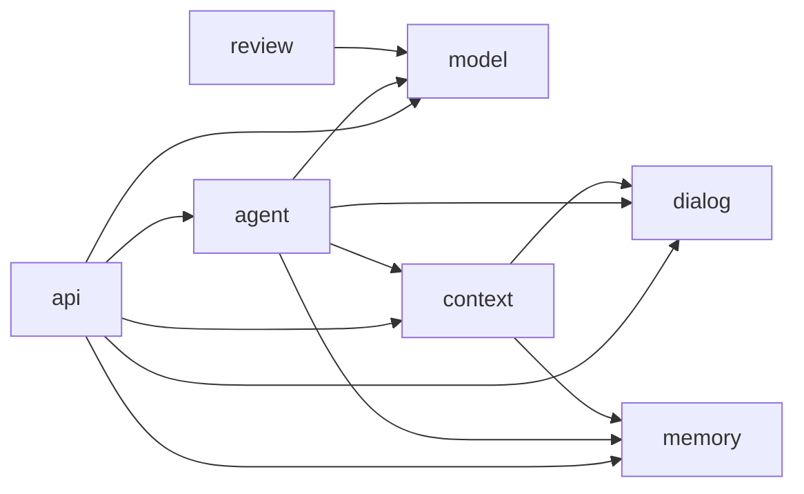

# Local AI Worker — Architecture Contract

Этот документ фиксирует устойчивые границы проекта. Он не является class catalog
и не утверждает существование будущих компонентов. Product authority —
[`PRODUCT-MANIFEST.md`](PRODUCT-MANIFEST.md); причина направления зафиксирована в
[`decisions/ADR-001-local-ai-worker-direction.md`](decisions/ADR-001-local-ai-worker-direction.md).

## CURRENT

Local AI Worker — product identity; Engineering Review Mentor — специализированный
исторический use case. Backend находится в `dev.aiadvent.worker`; в корне остаются
только `LocalAiWorkerApplication` и CLI launcher `Main`.

| Capability | Ответственность | Product dependencies |
|---|---|---|
| `model` | Neutral execution contract и provider implementations | нет |
| `dialog` | Canonical conversation, raw history, checkpoints/branches и persistence | нет |
| `memory` | Retained/derived state и его persistence | нет |
| `context` | Per-call projection, token estimation и limits | `dialog`, `memory` |
| `agent` | Conversation orchestration, main/summary/Sticky Facts calls | `model`, `dialog`, `memory`, `context` |
| `api` | HTTP boundary | `agent`, `model`, `dialog`, `memory`, `context` |
| `review` | Специализированный historical engineering-review use case и его HTTP endpoints | `model` |

Зависимости между capabilities следуют этой таблице; циклов нет. `model` не владеет
canonical conversation/domain state: сообщения принадлежат `dialog`. `memory` и
`ContextPolicy` не исполняют модели. `agent` использует neutral executor contract,
не concrete provider clients, и не зависит от `api`/`review`. Нижние capabilities
не знают о controllers/API; `review` не зависит от generic orchestration/state.
Зависимость `context -> memory` нужна для проекции summary и Sticky Facts.

Angular UI обращается к Spring API. `AgentDialogService` и `ConversationAgent`
координируют dialog, persistence и model calls. Current provider boundary
исполнен через `AgentModelCatalog` и `AgentModelExecutor`. Catalog разрешает
backend-owned selection key и default DeepSeek; тонкие DeepSeek/OpenAI adapters
исполняют единый model-call contract. Orchestration передаёт выбранный executor
в main, summary и Sticky Facts calls, не выбирая provider.
Execution contract — `complete(AgentModelRequest)`: ordered `AgentModelMessage`,
model, temperature и maxTokens; результат — content и optional `ProviderUsage`,
ошибка — `ModelExecutionException`. Conversation values преобразуются в execution
DTO выше этой границы; executor contract не зависит от `AgentConfig` или
`ConversationContext.Message`.

### State and topology

**Canonical conversation memory** — complete ordered raw history, persisted per
dialog. It is the source of truth for linear conversation. A failed provider
call or context-limit rejection must not make rejected user input canonical.

**Derived memory** — summary and Sticky Facts. They may be regenerated from
canonical raw history; they do not replace or override it. Their maintenance
calls and metrics remain distinguishable from main calls.

**Topology** — immutable checkpoints and branch-local continuations. A branch
is not a ContextPolicy and branch state does not leak into linear raw history
or sibling branches. Dialog identity, checkpoint identity and branch identity
remain explicit.

### Context and model calls

`ContextPolicy` constructs the representation for exactly one model call from
available state. Existing linear modes include FULL, SUMMARY_RECENT,
SLIDING_WINDOW and STICKY_FACTS; branching uses branch-local FULL context. A
policy must not destructively mutate canonical raw memory.

Memory owns retained interaction/state; context/adaptation owns only the projection into one
effective model request. Storage/state components must not construct provider prompts directly;
the model/provider execution layer likewise does not own repository or storage concerns.

Metrics observe concrete provider calls — request/context/response estimates and
optional provider usage — but are not agent state. Summary and facts maintenance
metrics are kept separate from main response metrics.

`DeepSeekTransport` владеет request JSON, HTTP и извлечением completion/finish_reason/usage.
Он не зависит от conversation/domain state, context/memory/dialog или review DTO.
`DeepSeekAgentModelExecutor` зависит только от transport, а не от review facade.
Исторический review facade `DeepSeekReviewClient` использует тот же Spring-managed transport и сохраняет
review prompts, controlled parsing/validation и free/reasoning/temperature methods.
Endpoint, model IDs, payload fields, message ordering, sampling options, error/retry
и rawResponse semantics сохранены при package separation; миграция persisted data не требуется.

### Evidence today

Current challenge evidence consists of tracked task/run documentation plus
ignored local raw runtime evidence where appropriate. Git state, source files,
commands and test results remain independently inspectable inputs; an LLM prose
answer alone is not authority.

### UX Shell V1 — реализованная граница

UX Shell V1 реализован: `AgentModelService` получает backend-owned catalog, а
`AgentInspector` предоставляет компактную правую панель. `App` сохраняет выбранный
key в dialog UI state и координирует существующие действия; backend принимает только
безопасный key, без arbitrary model IDs, endpoints или credentials. Отсутствующий key
сохраняет DeepSeek default. Выбор не входит в identity истории или turn lock и не
меняет ContextPolicy, Memory, Task scope либо branches/checkpoints.

### Dialog lifecycle — реализованная граница

`DELETE /api/dialogs/{id}` is orchestrated by `AgentDialogService`, not by lower stores. It removes
only the dialog document, raw history, summary, Sticky Facts, branch/topology state, dialog-scoped
`SHORT_TERM` memory and cached in-process dialog state. `WORKING` task memory, global/user-scoped
`LONG_TERM`, other dialogs and shared task state are preserved. The Angular sidebar exposes this
supported lifecycle through compact recent rows, «Показать ещё» and a confirmed delete action.

Explicit memory terminology is semantic: `SHORT_TERM` = dialog scope, `WORKING` = task scope,
`LONG_TERM` = user scope. The current single-user/local global representation implements the last
scope; physical persistence does not define it.

## FUTURE DIRECTION

The following are extension points, not components that exist now.

### Task / Run boundary

A future **Task/Run** represents a unit of research or bounded work: requested
goal, inputs, execution state, tool invocations, model calls, artifacts and
result. A dialog remains a communication mechanism and may later initiate,
observe or discuss a Task/Run, but must not be redefined as one.

### Profile, TaskState and controlled transitions

Profile is future orchestration configuration — response style/format, workflow, roles and
behavioral constraints — and is not Memory. Day 12 may introduce it without reinterpreting
accumulated `LONG_TERM` information.

Day 13 may introduce a first-class Task and persisted happy-path `TaskState`:
`planning -> execution -> validation -> done`, including pause/resume. Current Day 11 `taskId`
remains only a `WORKING`-memory scope key until then.

Day 14 may introduce invariants as rules that must not be violated, distinguishing deterministic
constraints from semantic invariants that need contextual/model evaluation. Day 15 may add the
controlled transition graph and red paths: a model proposes an action, application code validates
the transition, and only that boundary changes TaskState. Neither is implemented now.

### Deterministic tools, retrieval and artifacts

Future repository/document research should prefer deterministic local tools
(search, Git, symbol or structural discovery, tests) before LLM reasoning.
Retrieval/RAG may select code or knowledge context, but does not become
canonical conversation memory. Tools and a future MCP boundary are separate
from ContextPolicy.

Future research results may pair a human-readable `RESEARCH.md` with machine
inspectable `EVIDENCE.json`; the exact schemas are intentionally deferred.

### Replaceable model and orchestration boundaries

A local RTX 3090-backed model provider may be added behind a model-provider
boundary introduced only when a real requirement needs it. Choice of model,
Ollama, llama.cpp or another runtime is not made here. Week 4 may introduce a tool/MCP boundary for cloud-agent
delegation; its transport is deferred. Week 7 may orchestrate multi-step tasks
using existing state, tools, providers and artifacts; no workflow engine or
plugin architecture is implied.

## Architectural invariants

1. Dialog != Task/Run.
2. Local Worker != Local LLM; provider choice must remain replaceable.
3. LLM != repository search engine; deterministic discovery comes first.
4. Raw history is canonical; summary and facts are derived and rebuildable.
5. Checkpoints/branches are topology; ContextPolicy is a per-call projection.
6. Metrics are observations, not agent state.
7. Retrieval/RAG is neither canonical memory nor a replacement for evidence.
8. Tools/MCP are not ContextPolicy.
9. Important claims should expose inspectable evidence where practical.
10. New challenge capabilities are additive layers and do not silently change
    existing layer semantics.
11. Profile config != Memory; TaskState, invariants and transition control are distinct concepts.

When a future Day requires a real change to one of these boundaries, update
this contract and record the decision before introducing the corresponding
implementation.
