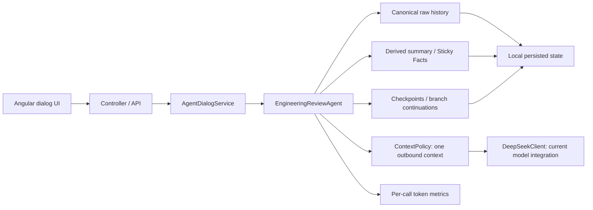

# Local AI Worker — Architecture Contract

Этот документ фиксирует устойчивые границы проекта. Он не является class catalog
и не утверждает существование будущих компонентов. Product authority —
[`PRODUCT-MANIFEST.md`](PRODUCT-MANIFEST.md); причина направления зафиксирована в
[`decisions/ADR-001-local-ai-worker-direction.md`](decisions/ADR-001-local-ai-worker-direction.md).

## CURRENT

Сейчас продукт содержит Engineering Review Mentor как один работающий use case.
Angular UI обращается к Spring API. `AgentDialogService` координирует dialog,
`EngineeringReviewAgent`, persistence и model calls. Current provider boundary
сейчас является интеграцией с `DeepSeekClient`; формальной interchangeable
model-provider boundary пока нет.

### State and topology

**Canonical conversation memory** — complete ordered raw history, persisted per
dialog. It is the source of truth for linear conversation. A failed provider
call or context-limit rejection must not make rejected user input canonical.

**Derived memory** — summary and Sticky Facts. They may be regenerated from
canonical raw history; they do not replace or override it. Their maintenance
calls and metrics remain distinguishable from main calls.

**Topology** — immutable checkpoints and branch-local continuations. A branch
is not a ContextPolicy and branch state does not leak into linear raw history
or sibling branches. Dialog identity, checkpoint identity and branch identity
remain explicit.

### Context and model calls

`ContextPolicy` constructs the representation for exactly one model call from
available state. Existing linear modes include FULL, SUMMARY_RECENT,
SLIDING_WINDOW and STICKY_FACTS; branching uses branch-local FULL context. A
policy must not destructively mutate canonical raw memory.

Metrics observe concrete provider calls — request/context/response estimates and
optional provider usage — but are not agent state. Summary and facts maintenance
metrics are kept separate from main response metrics.

### Evidence today

Current challenge evidence consists of tracked task/run documentation plus
ignored local raw runtime evidence where appropriate. Git state, source files,
commands and test results remain independently inspectable inputs; an LLM prose
answer alone is not authority.

## FUTURE DIRECTION

The following are extension points, not components that exist now.

### Task / Run boundary

A future **Task/Run** represents a unit of research or bounded work: requested
goal, inputs, execution state, tool invocations, model calls, artifacts and
result. A dialog remains a communication mechanism and may later initiate,
observe or discuss a Task/Run, but must not be redefined as one.

### Deterministic tools, retrieval and artifacts

Future repository/document research should prefer deterministic local tools
(search, Git, symbol or structural discovery, tests) before LLM reasoning.
Retrieval/RAG may select code or knowledge context, but does not become
canonical conversation memory. Tools and a future MCP boundary are separate
from ContextPolicy.

Future research results may pair a human-readable `RESEARCH.md` with machine
inspectable `EVIDENCE.json`; the exact schemas are intentionally deferred.

### Replaceable model and orchestration boundaries

A local RTX 3090-backed model provider may be added behind a model-provider
boundary introduced only when a real requirement needs it. Choice of model,
Ollama, llama.cpp or another runtime is not made here. Week 4 may introduce a tool/MCP boundary for cloud-agent
delegation; its transport is deferred. Week 7 may orchestrate multi-step tasks
using existing state, tools, providers and artifacts; no workflow engine or
plugin architecture is implied.

## Architectural invariants

1. Dialog != Task/Run.
2. Local Worker != Local LLM; provider choice must remain replaceable.
3. LLM != repository search engine; deterministic discovery comes first.
4. Raw history is canonical; summary and facts are derived and rebuildable.
5. Checkpoints/branches are topology; ContextPolicy is a per-call projection.
6. Metrics are observations, not agent state.
7. Retrieval/RAG is neither canonical memory nor a replacement for evidence.
8. Tools/MCP are not ContextPolicy.
9. Important claims should expose inspectable evidence where practical.
10. New challenge capabilities are additive layers and do not silently change
    existing layer semantics.

When a future Day requires a real change to one of these boundaries, update
this contract and record the decision before introducing the corresponding
implementation.
