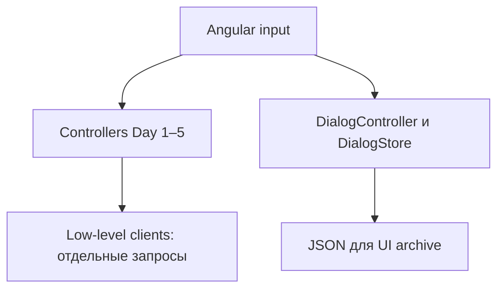
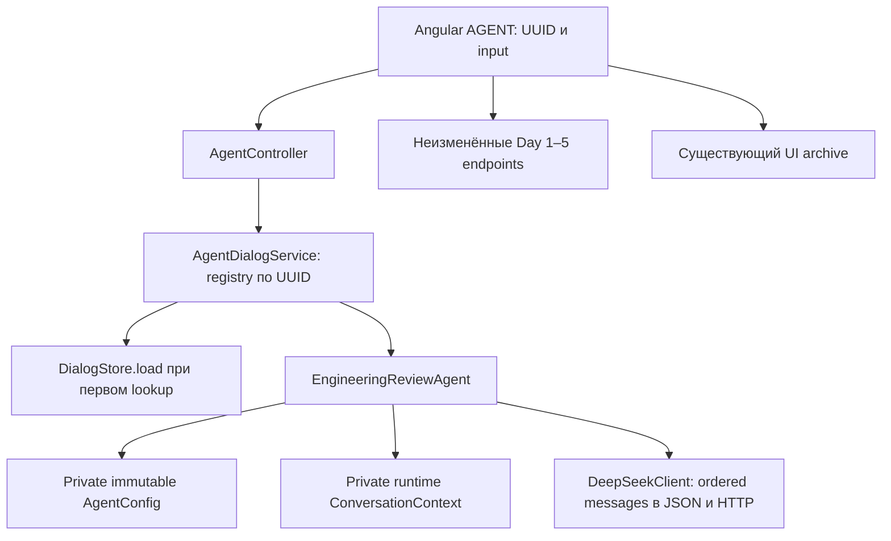

# Day 6 — архитектурное ревью рабочего дерева

Дата: 2026-09-10. Исполнитель: Codex. Результат: **PASS**.
MUST FIX: **NONE**. SHOULD FIX: **NONE**. Существенных подтверждённых дефектов или
архитектурных препятствий для заявленного Day 6 не обнаружено.

Проверены фактические изменения относительно `06355effc56d60b4d43b58c7e274b0ec20622337`,
включая содержимое untracked production/test/docs. Ветка `day_6`; HEAD и developer равны базе;
committed delta отсутствует, реализация находится в working tree. Staged diff пуст.
Основание: текущая инструкция владельца, [canonical task](../tasks/DAY-06.md),
[анализ](DAY-06-ANALYSIS.md), [implementation evidence](DAY-06.md), код и тесты.

Это отдельный read-only проход по реализации, а не новый прогон тестов и не утверждение
об участии другого независимого агента. Product/test код, прочие документы, runtime и Git state
не изменялись; создан только этот отчёт. API/browser/manual verification не выполнялись.

## 1. Diff sanity: классификация каждого файла

Снимок до создания отчёта: **15 modified + 11 untracked = 26 файлов**.
Классификация по текущему назначению файла: **19 DAY6_INTENDED, 7 PRE_EXISTING, 0 UNRELATED / SUSPICIOUS**.
Два DAY6_INTENDED документа содержат также pre-existing hunks — это отражено в таблице,
а не приписано реализации Day 6. Анализ и task появились в предыдущем planning-проходе Day 6.

| Статус | Файл относительно корня | Классификация | Основание |
|---|---|---|---|
| M | README.md | DAY6_INTENDED | Секция Day 6 и runtime-memory semantics |
| M | app/src/main/java/dev/aiadvent/mentor/DeepSeekClient.java | DAY6_INTENDED | Ordered messages и reuse send |
| M | app/src/test/java/dev/aiadvent/mentor/MainTest.java | DAY6_INTENDED | Два теста transport/context boundary |
| M | docs/CURRENT-STATE.md | DAY6_INTENDED | Day 6 state; также сохранены прежние Day 1–5 publication hunks |
| M | docs/DAY-05-REPORT.md | PRE_EXISTING | Day 5 publication status, существовал до Day 6 |
| M | docs/SESSION_START.md | DAY6_INTENDED | Day 6 entrypoint; также прежние publication/runtime updates |
| M | docs/agent-runs/DAY-05.md | PRE_EXISTING | Publication/integration checkpoint 2026-09-07 |
| M | docs/tasks/DAY-01.md | PRE_EXISTING | Прежние publication/video сведения |
| M | docs/tasks/DAY-02.md | PRE_EXISTING | Прежние publication/video сведения |
| M | docs/tasks/DAY-03.md | PRE_EXISTING | Прежние publication/video сведения |
| M | docs/tasks/DAY-04.md | PRE_EXISTING | Прежние publication/video сведения |
| M | docs/tasks/DAY-05.md | PRE_EXISTING | Прежние publication/submission сведения |
| M | frontend/src/app/app.html | DAY6_INTENDED | AGENT UI, разделение веток, Day badge |
| M | frontend/src/app/app.spec.ts | DAY6_INTENDED | AGENT UI flow/errors |
| M | frontend/src/app/app.ts | DAY6_INTENDED | AGENT discriminator и POST |
| ?? | app/src/main/java/dev/aiadvent/mentor/AgentConfig.java | DAY6_INTENDED | Immutable communication config |
| ?? | app/src/main/java/dev/aiadvent/mentor/AgentController.java | DAY6_INTENDED | HTTP boundary |
| ?? | app/src/main/java/dev/aiadvent/mentor/AgentDialogService.java | DAY6_INTENDED | Runtime registry |
| ?? | app/src/main/java/dev/aiadvent/mentor/ConversationContext.java | DAY6_INTENDED | Message state и snapshots |
| ?? | app/src/main/java/dev/aiadvent/mentor/EngineeringReviewAgent.java | DAY6_INTENDED | Turn orchestration и lock |
| ?? | app/src/test/java/dev/aiadvent/mentor/AgentControllerTest.java | DAY6_INTENDED | MVC contract |
| ?? | app/src/test/java/dev/aiadvent/mentor/AgentDialogServiceTest.java | DAY6_INTENDED | Identity/isolation/restart |
| ?? | app/src/test/java/dev/aiadvent/mentor/EngineeringReviewAgentTest.java | DAY6_INTENDED | History/config/concurrency |
| ?? | docs/agent-runs/DAY-06-ANALYSIS.md | DAY6_INTENDED | Planning history и ссылочная актуализация |
| ?? | docs/agent-runs/DAY-06.md | DAY6_INTENDED | Concise implementation evidence |
| ?? | docs/tasks/DAY-06.md | DAY6_INTENDED | Canonical requirement/plan/result |

Pre-existing происхождение подтверждено начальным status предыдущих проходов этой сессии;
семь целиком pre-existing файлов сохраняют ранее зафиксированные SHA-256.
В snapshot нет binaries, build output, dependencies, .env, credentials или raw local evidence.
В прочитанном содержимом не обнаружено секретов; дополнительный поиск явных sk-key/private-key
форматов в 26 файлах дал 0 кандидатов. `test-key`, synthetic model names и test UUID — фикстуры.
Это проверка указанного diff, не заявление о полном secret audit всего компьютера/истории Git.

`git check-ignore` подтверждает исключение target/, frontend/dist/, frontend/node_modules/,
docs/local/agent-sessions/ и docs/local/mentor-dialogs/. Tracked Day 6 report — запрошенный
краткий отчёт, не случайно добавленный raw log. CSS, package-lock, pom/dependencies не менялись.
`git diff --check` не выявил whitespace errors. Новый review-файл добавляет один ожидаемый
untracked документ: после ревью **15 modified + 12 untracked**. Ничего не очищено и не отменено.

## 2. AS-IS и TO-BE изменений Day 6

AS-IS — база Day 6, до реализации:



TO-BE — фактический working tree; ревью не требует его менять:



## 3. Responsibility boundaries и practical quality

Java-пути в этой секции относительны `app/src/main/java/dev/aiadvent/mentor/`.

| Компонент / evidence | Оценка |
|---|---|
| AgentController.java:15–49 | UUID binding, input validation, DTO и HTTP mapping 404/409. Делегирует service; не знает Message/Context и не вызывает LLM. SRP соблюдён |
| AgentDialogService.java:11–26 | Только identity/lifecycle и delegation. load до регистрации корректен: не разрешает произвольному UUID создать беседу без существующего диалога. Ни prompt, ни history mutation, ни save/restore; god-service отсутствует |
| EngineeringReviewAgent.java:6–30 | Private final config/context/client, полный turn в reply. Нет Spring annotations, HTTP statuses, JSON, filesystem или UI. BusyException отражает состояние turn, HTTP выбирает controller |
| ConversationContext.java:7–24 | Private list, typed immutable Message, копия + List.copyOf. Нет наружной ссылки на mutable backing list; строки и record immutable. Только commit добавляет сразу роли user/assistant в установленном порядке |
| AgentConfig.java:5–24 | Immutable agent settings без credentials/UI/history. Default model и prompt точно соответствуют Day 1; temperature/maxTokens null не меняют прежний wire preset |
| DeepSeekClient.java:75–130 | Stateless для conversation; принимает explicit ordered list, сериализует, вызывает HTTP, декодирует ответ. Не добавляет system и не хранит stack |
| frontend/src/app/app.ts:178–184,303–311; app.html:120–122,203,240–255 | AGENT отправляет только input по текущему UUID, reuse Markdown/result/loading. AGENT исключён из comparison/controlled/temperature веток |

**SRP/cohesion:** классы небольшие и имеют реальные разные причины изменения: HTTP contract,
identity/lifetime, turn semantics, message storage in memory, configuration, provider protocol.
Отдельный ConversationContext оправдан текущими операциями snapshot/commit, а не будущим Day 9.

**Encapsulation:** context сам не thread-safe, и это корректно: instance private внутри агента,
все его обращения защищает один turnLock. Не требуется второй lock в context. Публичных setters,
доступа к backing list или принятия browser history нет.

**Coupling/dependency direction:** агент прямо зависит от concrete DeepSeekClient, что согласовано
с одним provider и low-level integration. Client использует маленький domain record
ConversationContext.Message, а не mutable context; это не обратное управление состоянием.
Вынос Message в отдельный файл не улучшит текущий контракт. Reuse ReviewController.ApiError
связывает два класса одного API-слоя, но не переносит HTTP в agent/domain. Отдельный DTO framework
не оправдан этим единственным употреблением.

**SOLID:** composition вместо inheritance. LSP не порождает требований к отсутствующей иерархии;
ISP не требует создавать интерфейс для одного клиента. Новый Day 6 path добавлен без изменения
legacy callers. Возможность mock реального network boundary уже есть, обязательный Provider
interface сейчас не решает текущую проблему тестируемости.

**KISS/YAGNI/DRY:** короткий registry, конкретный агент и existing transport достаточны. HTTP send
переиспользован. Agent prompt сейчас совпадает с Day 1, но legacy experiment и conversation persona
могут меняться независимо; объединять их только ради одинакового текста не нужно. Не нужно
переносить controlled validation/Day 3 orchestration в агента для формальной «централизации».

**Точная граница AgentConfig:** whitelist температуры 0/0.7/1.2 действительно взят из Day 4,
а bounds maxTokens 100…2000 — из Day 2. Это локальные ограничения, явно записанные в утверждённом
task §5, не универсальные ограничения provider API. Например, 0.5 сейчас отвергается. Поэтому
конфигурацию нельзя описывать как поддержку произвольного sampling preset. Однако текущий
scope не требует 0.5, иной ceiling или выбора произвольного provider; ограничения не блокируют
заданные сценарии и разные экземпляры. Существенного finding/требования расширить диапазон сейчас
нет. Day 4 comparison logic, Day 5 model tiers/pricing/OpenAI settings в агента не попали.

**Существующий DeepSeekClient не является идеальным чистым adapter во всём файле:** Day 1/2 prompts
и controlled-response validation уже находились там в базе. Новый completion path не расширяет
эту старую смешанную ответственность. Переработка всего клиента была бы unrelated redesign,
а не необходимым исправлением Day 6.

## 4. Concurrency: NO CHANGE NEEDED

1. Без сериализации race реален: два servlet-потока могут снять одинаковый старый context,
   параллельно вызвать модель и зафиксировать ответы, каждый из которых не учитывает другой turn.
   Одновременные ArrayList mutations дополнительно небезопасны. Lock только вокруг commit
   исправил бы list race, но не семантический порядок беседы.
2. Agent boundary — правильное место: `reply` захватывает lock до snapshot, освобождает после
   commit/exception. Изоляция не зависит от того, вызвали agent через HTTP или напрямую.
3. `tryLock` достаточен для текущего приложения: UI уже блокирует send во время запроса;
   конкурентная вкладка/клиент получает явный busy вместо скрытого ожидания и ещё одного API call.
   Приложение не обещает очередь, fairness или автоматическую доставку отклонённого turn.
4. `409 Conflict` уместен для принятого контракта: запрос конфликтует с текущим состоянием этой
   беседы. Это не глобальная перегрузка и не rate limit. AgentController.java:39–42 локально
   отображает BusyException; остальные endpoints не меняют semantics.
5. `synchronized reply` был бы чуть короче, но заставлял бы servlet-потоки ждать LLM и затем
   выполнять накопленные запросы. CAS busy-flag потребовал бы ручного протокола владения.
   Нынешний ReentrantLock + finally — небольшой стандартный механизм с явным поведением.
6. `computeIfAbsent` даёт один опубликованный экземпляр на UUID даже при двух первых запросах.
   `load` находится до compute и до LLM. Во время HTTP не удерживается общий store/map monitor.
   Два отдельных UUID имеют отдельные locks/context. Новая infrastructure не нужна.

## 5. Failure invariants

Пусть committed context перед turn равен `[S,U1,A1,U2,A2]`.
ConversationContext.withUserMessage создаёт новый список `[S,U1,A1,U2,A2,U3]`, не изменяя original.
EngineeringReviewAgent вызывает complete **до** context.commit. DeepSeekClient бросает exception
при transport/HTTP failure, malformed JSON и отсутствующем/blank analysis text
(DeepSeekClient.java:114–130,185–192). Поэтому на этих путях commit недостижим:
после ошибки остаётся `[S,U1,A1,U2,A2]`. finally освобождает lock; следующий успешный turn нормален.

Атомарность здесь — наблюдаемая атомарность пары внутри одного runtime agent: оба add идут
под единственным lock, между ними нет external I/O и ни один другой turn не видит половину пары.
Это не persistence transaction и не crash-safe guarantee, которых Day 6 не требует.
Проверять ответ ещё раз в agent не нужно: непустой результат гарантирует существующий client
boundary; искусственный mock, возвращающий null вместо своего контракта, не production сценарий.

Фактические tests: providerFailureLeavesHistoryUnchangedAndDoesNotRetry проверяет одну сохранённую
пару, failure и успешное продолжение с точным outbound списком. MainTest проверяет empty HTTP
content на реальном client с mocked HttpClient, затем следующий turn без failed input.
Буквального теста «две пары → error» нет; invariant для любой длины следует из отсутствия
mutation до complete. Дублирующий тест только ради числа пар существенно уверенность не повысит.

При nonempty `finish_reason=length` новый FREE-compatible путь, как прежний FREE, возвращает текст;
он не наследует strict controlled JSON finish policy. Это не silently introduced breaking change.
Exactly-once при потере ответа браузеру и атомарность UI archive/agent state не заявлены.

## 6. Day 1–5 regression risk

Риск мал и локализован общим transport send и Angular discriminator handling.
Legacy analyze/analyzeWithSystem/analyzeAtTemperature/analyzeControlled, JSON builders,
input/key validation и response parsing сохраняют прежние вызовы/порядок; новый private send
overload только выносит прежний HTTP body. OpenAI Day 5 вообще не менялся.

Проверена semantic closure AGENT: analyze dispatch, exchange rendering, experiment controls,
comparison actions, model badge, DialogUiState restore, persistDialog/withoutLoading.
AGENT использует existing free ResultState, поэтому withoutLoading очищает его loading без новой
ветки. Вкладка не вызывает legacy comparisons. Existing restored experiments идут прежними путями.

Сохранённые AGENT UI карточки переживают refresh/restart, но agent registry не читает их.
UI явно объясняет разницу. Отсутствие LLM-memory restore — требование, не регрессия Day 1–5.
Предыдущие test assertions не ослаблены; старые 46 backend и 15 frontend tests остаются.

## 7. Days 7–9: естественные места будущих изменений

| Будущий день | Где локализуются изменения | Что потребуется продумать тогда |
|---|---|---|
| Day 7 | Registry creation/load и context snapshot/restore; отдельный storage collaborator у turn/lifecycle boundary | Сохранение config/system и ordered messages; поведение при storage failure; согласование runtime и persisted state. Read-only snapshot/restore API добавить тогда, не открывать mutable list |
| Day 8 | DeepSeekClient response parsing для usage; результат agent turn; agent/context preparation для искусственного limit | Сейчас client возвращает String — его Day 6 result можно расширить, сохранив legacy String wrappers. UI/API расширить только для новых наблюдений. Artificial input-context limit не смешивать с maxTokens output limit |
| Day 9 | Подготовка сообщений в agent/ConversationContext | Отдельные summary и последние N raw messages; изменения persisted state согласовать с Day 7. Transport продолжит принимать ordered messages без знания compression |

Архитектурных препятствий, требующих переписать unrelated controllers/experiments, нет.
Отсутствие готового storage/summary интерфейса не является препятствием: нужные state/turn
границы уже видны. Рост всей памяти до restart — сознательный Day 6 contract, не повод сейчас
добавлять eviction/TTL/токенизацию. Преждевременных future-only abstractions в коде не найдено.

## 8. Pattern assessment

| Паттерн | Конкретная текущая проблема | Почему текущая форма оправдана сейчас |
|---|---|---|
| Adapter — DeepSeekClient | JSON/HTTP/ошибки внешнего DeepSeek отличаются от agent turn API | Изолирует действующую сетевую границу; перенос HTTP в agent ухудшил бы cohesion и тестируемость. Дополнительный interface не требуется |
| Registry — AgentDialogService | Следующий запрос того же UUID должен попасть в тот же runtime object, другой UUID — в другой | Без registry пришлось бы восстанавливать state на каждый запрос или делить один mutable agent; map решает уже существующую задачу |

Новых абстракций/паттернов к добавлению не рекомендуется. Repository станет предметом Day 7
при появлении реальной persistence boundary, но сегодня хранить conversation на диске запрещено.
Strategy в Day 9 оправдается только при реальной необходимости переключать несколько policies;
для одной summary policy может остаться достаточно конкретного метода/класса.
Ни Repository, ни Strategy для conversation сейчас не реализованы и не требуются.
AbstractAgent, factories/provider framework, event bus, CQRS/workflow engine не обоснованы.

## 9. Качество тестов и evidence

| Инвариант | Что тест действительно доказывает |
|---|---|
| System + первый user, последующие turns | EngineeringReviewAgentTest сравнивает точные роли/content на трёх outbound calls; whitespace input не теряется |
| Commit/snapshot | Ответы появляются в следующем call; прежний captured snapshot остаётся прежним; clear отклоняется |
| Config isolation | Два реальных агента передают разные model/system/temperature/maxTokens одному mocked client |
| Provider failure | Следующий outbound request содержит только прежнюю successful history и текущий input; ровно один provider call на попытку |
| Empty response | Реальный transport parsing на mocked HTTP response, исключение и успешное продолжение без failed message |
| A/B + restart | Real DialogStore с TempDir, разные UUID, A/B/A, fresh service и байт-в-байт сохранность исходного UI JSON |
| Concurrent turns | Latches удерживают provider call; второй turn получает busy, другой agent продолжает; после освобождения history корректна |
| Concurrent first lookup | Два стартующих потока, один success/один busy, следующий turn видит одну пару. Test не исчерпывает все scheduler interleavings; atomic creation дополнительно подтверждён computeIfAbsent в коде |
| HTTP | Real service через MockMvc; статусы success/400/404/409/502/500, invalid/missing id без provider call |
| Frontend | Реальный template/component + HttpTestingController: AGENT controls, body только input, A/follow-up/B/A, сохранение/replay UI archive, safe Markdown, error и manual resend |

Mock используется на expensive I/O границах; stateful агент и registry не подменены mock в их
основных behavioral tests. Captured complete arguments — проверяемый внешний для агента контракт,
а не обращение к private list или introspection lock. Spy в MainTest наблюдает тот же контракт,
при этом HTTP/JSON parsing исполняется реальный.

Exact JSON field count фиксирует отсутствие непредусмотренных provider features; будущий
intentional новый параметр потребует обновить этот contract test — это уместно, не случайная
хрупкость. Latches/barriers предпочтительнее sleeps. В тестах есть ограниченные 5-second waits;
предыдущая проблема barrier внутри synchronized mock уже исправлена, текущий PASS подтверждён.
Нет materially brittle tests или пропущенных случаев, блокирующих переход к ручной проверке.
UI-тест не доказывает память реального provider — это правильно разделено с backend tests/demo.

В этом ревью тесты/build **не запускались заново**. Прочитаны текущие Surefire XML:
58 tests, failures/errors/skipped = 0; предыдущие frontend logs: 17/17 PASS, production build PASS.
Код после этих прогонов не менялся; проверена read-only граница этого review-прохода.
Existing app.scss warning не связан с Day 6: CSS/budgets не изменены, build прошёл.

Команды владельцу при необходимости повторного deterministic gate:

```powershell
Set-Location <local-workspace>
$env:JAVA_HOME = 'C:\Program Files\Java\jdk-21'
$env:Path = "$env:JAVA_HOME\bin;$env:Path"
mvn package
Set-Location <local-workspace>
$env:Path = "<local-workspace>\AppData\Local\nvm\v22.22.3;$env:Path"
npm test -- --watch=false
npm run build
```

## 10. Решение и следующий шаг

**PASS. Исправления перед real-API/manual verification не требуются.**
Готовность здесь архитектурная и deterministic; реальная доступность модели, качество follow-up,
desktop layout и наличие видео остаются непроверенными. Следующий шаг после отдельного разрешения
владельца — manual real-API A/follow-up → B → A сценарий canonical task §9.

Review не требует rollback: продуктовый код не менялся. Никаких clean/revert, API calls,
browser/manual проверок, commit/push/merge не выполнено.
