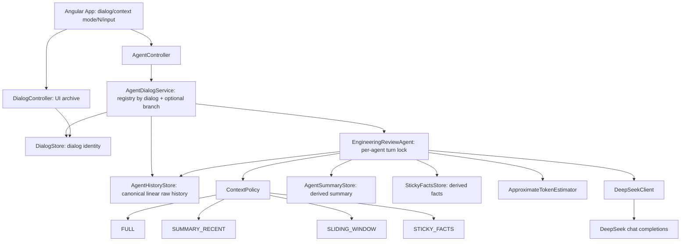
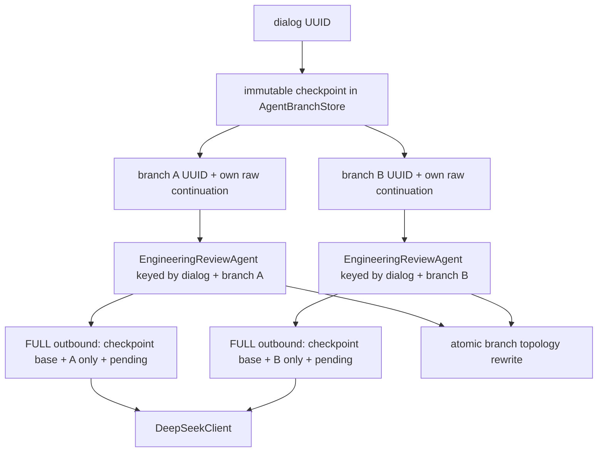
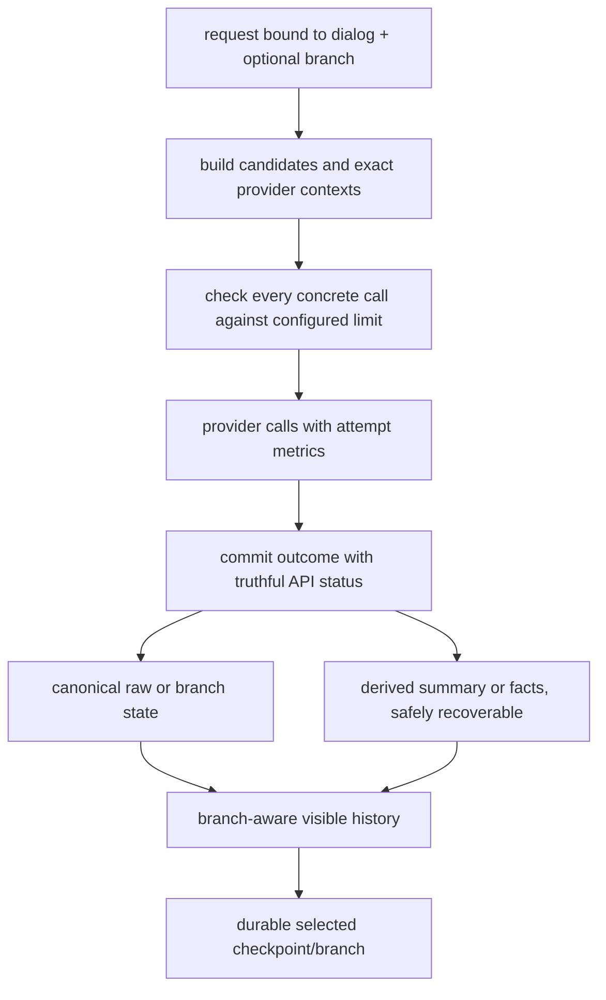

# AI Advent — Week 2 final independent review

Дата review: 2026-09-11  
Scope: Days 6–10 как одна интегрированная система  
Режим: read-only review; product code, tests, Git refs и index не изменялись

## FACTUAL STATE

- Фактическая ветка: `day_10` — совпадает с ожиданием.
- Фактический HEAD: `f2db8634453182de927f21412fd069b8e33b8297` — совпадает с ожиданием.
- Subject HEAD: `feat: add context management strategies` — совпадает с ожиданием.
- Parent HEAD: `314c57eb9ebf3b40476d230a4af3dcaa8d3b5895` (`day_9`).
- Week 2 lineage линейный и подтверждён Git:
  `2966cbe` Day 6 → `c0d7363` docs → `877f785` roadmap → `b2eb28e` Day 7 →
  `e008594` Day 8 → `4597f3b` Day 9 → `314c57e` docs → `f2db863` Day 10.
- База Week 2: `06355effc56d60b4d43b58c7e274b0ec20622337` (`developer`).
- Week 2 changed-file set от базы до HEAD: 67 файлов, 4601 insertion / 48 deletion:
  28 backend production, 11 backend tests, 3 frontend, 23 docs, 2 repository metadata.
- Working tree до review содержал только известный noise: modified `README.md`,
  `docs/REFERENCES.md`, `docs/agent-runs/DAY-04.md`; staged diff отсутствовал.
- После tests/build этот набор не изменился. Единственное изменение review — данный untracked report.
- Discrepancy: `docs/CURRENT-STATE.md`, `docs/SESSION_START.md` и `docs/tasks/DAY-10.md` называют
  Day 10 `uncommitted` и следующим действием owner commit, хотя commit `f2db863` уже является HEAD.
- Discrepancy: Day 10 docs фиксируют 87 backend tests, фактический `mvn test` на HEAD выполняет 89.

## WEEK 2 ARCHITECTURE

Фактический linear data flow — **AS-IS**:

Фактический branching data flow — **AS-IS**:

Canonical linear memory — strict `system, user, assistant...` stack in `AgentHistoryStore`.
Runtime `ConversationContext` is restored from it and committed only after the corresponding store write.
Summary and Sticky Facts are separate derived files. Branch histories are separate topology state in
`AgentBranchStore`; they do not enter `AgentHistoryStore`.

Минимальная требуемая граница после исправлений — **TO-BE**:

## REQUIREMENTS COVERAGE

| Day | Requirement | Actual coverage | Verdict |
|---|---|---|---|
| 6 | Stateful agent, owned config/history, failed call does not advance, same-dialog protection | Core stateful/locking/provider-failure behavior exists; Day 10 facts-store failure reintroduces an error path that advances canonical/runtime state | PARTIALLY_COVERED |
| 7 | Complete raw durable memory, restart, dialog isolation | Linear raw stack is durable, strict and isolated; however a failed Sticky turn can already append to it | PARTIALLY_COVERED |
| 8 | Request/context/response metrics, provider usage separation, overflow without mutation | Main successful-call metrics are exact for sent stacks; maintenance paths bypass complete overflow/metrics semantics | PARTIALLY_COVERED |
| 9 | FULL and SUMMARY_RECENT, complete raw history, separate persisted summary/reuse | Context construction, restart and reuse are implemented; summary can persist during a subsequently rejected overflow turn | PARTIALLY_COVERED |
| 10 | Sliding, Sticky Facts, Branching topology and comparison | Backend policies/topology work; Sticky atomicity and frontend branch topology/restart behavior are incomplete | PARTIALLY_COVERED |

## FINDINGS

### HIGH-1 — Sticky Facts persistence failure returns failure after canonical/runtime commit

**SEVERITY:** HIGH  
**LOCATION:** `app/src/main/java/dev/aiadvent/mentor/EngineeringReviewAgent.java`,
`reply`, lines 120–129; `EngineeringReviewAgentTest.stickyFactsStorageFailureLeavesRawStateRecoverable`,
lines 385–405.  
**EVIDENCE:** The code saves completed raw history, commits `ConversationContext`, and only then saves
Sticky Facts. If `factsStore.save` throws, the request returns HTTP 500 via the global IOException handler,
but both durable raw memory and runtime memory already contain the user/assistant pair. The existing test
explicitly asserts this partial commit (`histories.save` called and context size becomes 3).  
**SCENARIO:** Send a `STICKY_FACTS` turn; facts extraction and main provider succeed; facts filesystem
write fails. The client sees an error and retries the same input. The retry outbound context already contains
the supposedly failed first turn and appends a duplicate turn on success.  
**IMPACT:** Error semantics are false, user input rejected by the API becomes visible later, retry can duplicate
provider work and canonical turns, and raw/facts snapshots are inconsistent.  
**CROSS-DAY EFFECT:** Violates Day 6 failed-turn rollback, Day 7 durable-memory atomicity, and Day 10
`raw source of truth / facts rebuildable derived state`.  
**FIX DIRECTION:** Once raw canonical save succeeds, do not turn a derived facts-save failure into a failed
turn; return the successful main response with an explicit derived-state warning/recovery marker, or introduce
a coordinated atomic commit. In either design, a returned failure must leave raw/runtime unchanged.  
**CONFIDENCE:** HIGH.

### HIGH-2 — SUMMARY_RECENT overflow can mutate summary; maintenance provider calls bypass the limit gate

**SEVERITY:** HIGH  
**LOCATION:** `EngineeringReviewAgent.reply`, lines 79–93 and 97–115;
`ConversationSummaryService.generate`, lines 24–39; `StickyFactsService.update`, lines 30–42.  
**EVIDENCE:** Summary generation and `summaries.save` occur before final outbound `contextTokens` is checked.
Sticky recovery/current extraction calls also occur before that check and have no per-maintenance context-limit
guard. Only the final main outbound stack is checked.  
**SCENARIO:** Configure `mentor.agent.context-token-limit=1`, keep one completed turn, no summary, then send
`SUMMARY_RECENT` with N=1. The summary provider call runs and its file is saved; the main stack then exceeds
the limit and API returns 413. In `STICKY_FACTS`, one or many maintenance calls can run before the same 413.
**IMPACT:** A rejected turn can mutate derived summary state and incur hidden provider calls/cost; a maintenance
prompt may itself exceed the configured limit. The Day 8 “overflow before provider/save” behavior is no longer
true across integrated modes.  
**CROSS-DAY EFFECT:** Regresses Day 8 context-limit semantics and violates the stated invariant that rejected
turns do not mutate canonical or derived state.  
**FIX DIRECTION:** Apply the configured limit to every concrete provider outbound; keep generated summary as
a candidate and persist it only after the main turn succeeds. Add mode-specific overflow tests for
SUMMARY_RECENT and STICKY_FACTS, including stale-facts recovery.  
**CONFIDENCE:** HIGH.

### HIGH-3 — Frontend branch switching leaks sibling continuations into the visible conversation

**SEVERITY:** HIGH  
**LOCATION:** `frontend/src/app/app.ts`, `Exchange` lines 42–53, `switchBranch` lines 155–157,
`analyzeAgent` lines 346–356; `frontend/src/app/app.html`, exchange loop lines 25–129.  
**EVIDENCE:** `Exchange` has no `branchId`; every branch and linear result is appended to the same `exchanges`
array. `switchBranch` changes only the target ID/context mode. Rendering always iterates the full array and
does not filter by branch. Although GET branches returns branch histories, the frontend ignores their contents.
**SCENARIO:** From one checkpoint, send “PostgreSQL” in branch A and “ClickHouse” in branch B. Switch back to A.
The provider receives only A (backend isolation works), but the UI still displays both A and B messages/results;
after restart the persisted UI archive cannot reconstruct ownership at all.  
**IMPACT:** The core Branching UX presents a false topology and exposes sibling decisions in the active branch,
making branch-local review/switching unreliable even though backend calls are isolated.  
**CROSS-DAY EFFECT:** Violates Day 10 topology/independent-continuation semantics at the product boundary.
**FIX DIRECTION:** Persist branch identity on each agent exchange or render directly from branch histories;
filter/project the visible conversation by selected linear/branch scope and test A→B→A plus restart.
**CONFIDENCE:** HIGH.

### MEDIUM-1 — Checkpoint selection is not durable and can target the wrong base

**SEVERITY:** MEDIUM  
**LOCATION:** `frontend/src/app/app.ts`, `DialogUiState` lines 55–60, `activateDialog` lines 321–339,
`loadBranches` lines 340–345, `switchBranch` lines 155–157; `AgentBranchController`, lines 26–39.  
**EVIDENCE:** `checkpointId` is not persisted in dialog UI state and is reset to null on activation. The API can
list branches but not checkpoints. After load, frontend chooses `branches[0].checkpointId` regardless of the
selected branch; switching branches does not update checkpointId.  
**SCENARIO:** Create checkpoint C without creating a branch, reload: C still exists on disk but cannot be listed
or selected, so “Создать ветку” stays disabled. Or create C1/C2, select a branch from C2 after restart, then
create a branch: UI uses the first listed branch’s C1.  
**IMPACT:** Persisted checkpoints can become unreachable and new branches can silently fork from the wrong base.
**CROSS-DAY EFFECT:** Weakens checkpoint ownership/restart and makes topology source selection ambiguous.
**FIX DIRECTION:** Expose/list checkpoints and persist/select the active checkpoint explicitly; derive the
selected checkpoint from the selected branch when appropriate.
**CONFIDENCE:** HIGH.

### MEDIUM-2 — Asynchronous branch UI operations can contaminate another dialog and allow duplicate topology actions

**SEVERITY:** MEDIUM  
**LOCATION:** `frontend/src/app/app.ts`, `createCheckpoint` lines 141–145, `createBranch` lines 148–152,
`loadBranches` lines 340–344.  
**EVIDENCE:** These requests do not enter the component loading/pending-request guard, capture no response
generation/current-dialog token, and have no error handler. Buttons remain active; responses mutate global
`checkpointId`, `branchId`, and `branches` even if another dialog became active.  
**SCENARIO:** Start loading branches for dialog A, switch to B before A responds; A’s branches populate B’s
selector. Or double-click create branch; two server branches are persisted and response order arbitrarily selects
one. A late create-branch response after dialog switch persists A’s branch ID into B’s UI state.  
**IMPACT:** UI can send a branch/dialog mismatch (404), show wrong topology, or create unintended siblings with
no visible error explanation.
**CROSS-DAY EFFECT:** Violates dialog isolation and reliable branch switching; backend identity checks expose the
contamination as errors but do not prevent stale UI state.
**FIX DIRECTION:** Track topology requests as in-flight, bind callbacks to the originating dialog/generation,
ignore stale responses, prevent duplicate submits, and surface errors.
**CONFIDENCE:** HIGH.

### MEDIUM-3 — Branch UI permits modes that backend rejects

**SEVERITY:** MEDIUM  
**LOCATION:** `frontend/src/app/app.html`, lines 273–289; `app.ts.switchBranch`, lines 155–157;
`AgentDialogService.reply`, lines 48–52.  
**EVIDENCE:** Selecting a branch forces FULL once, but the context selector remains enabled and lets the user
choose SUMMARY_RECENT, SLIDING_WINDOW, or STICKY_FACTS. Backend explicitly rejects branchId with non-FULL.
**SCENARIO:** Select branch A, then select STICKY_FACTS and submit. UI sends both fields; backend returns 400.
**IMPACT:** A valid-looking UI state cannot execute and misleadingly mixes topology with linear policy.
**CROSS-DAY EFFECT:** Violates the Day 10 boundary “Branching is topology, not ContextPolicy.”
**FIX DIRECTION:** Hide/disable linear context modes while a branch is selected and keep request state normalized.
**CONFIDENCE:** HIGH.

### MEDIUM-4 — Completed maintenance calls disappear from metrics when a later stage fails

**SEVERITY:** MEDIUM  
**LOCATION:** `EngineeringReviewAgent.reply`, lines 74–105 and 117–133;
`ReviewController.ApiExceptionHandler`, lines 59–69.  
**EVIDENCE:** Summary/facts metrics are local variables returned only in a successful `AgentReply`. If summary
generation or one/more facts extraction calls succeed and the main provider/save/overflow later fails, the API
error contains only `error/rawResponse`; actual completed maintenance calls are unreported.
**SCENARIO:** Sticky extraction succeeds with provider usage, main call returns 502. The user sees no facts
maintenance metrics even though billed work happened. SUMMARY_RECENT has the same issue after successful
generation followed by main failure.
**IMPACT:** Metrics are not complete observations around concrete provider calls and comparison totals undercount
failure paths.
**CROSS-DAY EFFECT:** Violates Day 8 metrics separation/observability as extended by Days 9–10.
**FIX DIRECTION:** Preserve and expose completed maintenance metrics in structured error responses (without
mixing them into main metrics), or durably record attempt-level metrics.
**CONFIDENCE:** HIGH.

### LOW-1 — Frontend Sticky Facts type does not match backend JSON contract

**SEVERITY:** LOW  
**LOCATION:** `frontend/src/app/app.ts`, `ContextMetadata` line 29;
`app/src/main/java/dev/aiadvent/mentor/ContextMetadata.java`, lines 3–4; `StickyFacts.java`, lines 7–33;
`frontend/src/app/app.spec.ts`, lines 188–191.  
**EVIDENCE:** Backend serializes `facts` as a `StickyFacts` object
`{coveredUserMessageCount, facts:{...}}`; frontend declares it as a direct `Record<string,string>` and its test
uses the incorrect direct-map shape. JSON rendering happens to display the nested object, masking the mismatch.
**SCENARIO:** Consume the real backend response with typed frontend code or add field-level facts UI logic; the
declared type and fixture are wrong.
**IMPACT:** Contract drift weakens compile-time safety and tests do not validate the real response shape.
**CROSS-DAY EFFECT:** Weakens Day 10 facts/API compatibility evidence.
**FIX DIRECTION:** Define the frontend type with coverage plus nested facts and update the fixture/rendering.
**CONFIDENCE:** HIGH.

### LOW-2 — Malformed topology with duplicate IDs is accepted

**SEVERITY:** LOW  
**LOCATION:** `AgentBranchStore.validate`, lines 134–153; `findBranch`, lines 94–98; `saveBranch`, lines 66–92.
**EVIDENCE:** Validation checks shape, history order and checkpoint-prefix consistency but not uniqueness of
checkpoint or branch IDs. `findBranch` then takes the first match, while `saveBranch` updates every matching
branch ID.
**SCENARIO:** A partial/manual/corrupt persisted JSON contains a duplicate branch ID under two checkpoints. Load
passes; reads are ambiguous and one save mutates both records.
**IMPACT:** Semantically malformed persisted topology is not rejected explicitly and may amplify corruption.
**CROSS-DAY EFFECT:** Weakens Day 10 topology identity and malformed-file recovery guarantees.
**FIX DIRECTION:** Reject duplicate checkpoint IDs and duplicate branch IDs during topology validation.
**CONFIDENCE:** HIGH.

## QUESTIONS

1. The exact Day 9 numbers `FULL context 4194`, `SUMMARY_RECENT 2309`, and `44.9% reduction` are not present in
   tracked Day 9 task/run docs or the retained local Day 9 JSON evidence. The percentage is mathematically correct,
   but the underlying two observations cannot be independently reconstructed from saved artifacts. Is there an
   omitted raw response/metrics artifact?
2. The local Day 9 record preserves a contradictory initial restart trace (`summaryGenerationObserved=true`) and
   a later targeted PASS. Static code and the later artifact support reuse by coverage; the cause of the original
   contradictory observation remains unknown, not a confirmed product defect.
3. There is no authentication/authorization layer in the application. Branch/dialog ownership is consistently
   scoped by dialog UUID, matching the existing local sandbox identity model. If UUIDs are intended as anything
   stronger than local identities, an explicit security requirement is needed.

## CROSS-DAY INVARIANTS

| Invariant | Evidence | Verdict |
|---|---|---|
| Raw linear history is canonical and complete | Strict validated stack; all policies build copies; no policy truncates store | PASS |
| Context is per-call representation, not memory | Four policies return new immutable lists | PASS |
| Summary/facts are separate derived memory | Separate stores/directories and service paths | PASS |
| Derived memory never replaces raw memory | No destructive history rewrite by summary/facts | PASS |
| Failed operation never advances visible/canonical turn | Provider/history/branch-save failures pass; facts-save failure advances raw/runtime | FAIL |
| Rejected overflow mutates no state | FULL/Sliding pass; Summary can save candidate before 413 | FAIL |
| Metrics observe each concrete provider call separately | Successful main/maintenance calls pass; later-failure paths lose maintenance metrics | PARTIAL |
| Branching is topology, not a ContextPolicy | Backend models it separately and enforces FULL | PASS_BACKEND / FAIL_FRONTEND |
| Branch continuations do not enter linear history | Separate branch store; acceptance raw linear count remained 3 | PASS |
| Dialog and sibling branches are isolated | Backend key/store lookup and captured requests show isolation | PASS_BACKEND / PARTIAL_UI |

## PERSISTENCE / RESTART REVIEW

- Raw history: complete strict ordered JSON per dialog; restart restoration and dialog isolation confirmed by code,
  tests and Day 7 real evidence.
- Summary: separate JSON per dialog, coverage-count reuse confirmed by code/test and targeted Day 9 restart artifact.
  Missing summary regenerates; malformed summary fails before main call. Same-count content replacement is not
  detected because coverage has no prefix hash, but product writes are append-only.
- Sticky Facts: separate JSON; missing/stale-behind state rebuilds from committed user messages; coverage ahead of
  raw resets to empty and rebuilds. Persisted store restart itself is covered; integrated fresh-service facts reuse
  is only indirectly covered.
- Checkpoints/branches: topology file is durable and backend restart/isolation is covered. Orphan checkpoints and
  selected checkpoint are not recoverable through current frontend/API.
- All four stores use temp file plus same-directory `ATOMIC_MOVE`, with non-atomic `REPLACE_EXISTING` fallback when
  the filesystem does not support atomic moves. Single-file writes are therefore best-effort atomic; cross-store
  operations are not transactional.
- Old Day 6–8 history files remain readable; missing Day 9/10 derived files follow regeneration/empty paths.
  Malformed structural files fail explicitly, except duplicate topology IDs described in LOW-2.

## FAILURE / ATOMICITY REVIEW

| Failure | Actual result |
|---|---|
| Main provider failure | No raw/branch/runtime commit; derived candidate facts not persisted |
| Raw history save failure | Runtime does not advance; manual retry excludes failed turn |
| Branch save failure | Runtime branch does not advance |
| Summary generation failure | No summary/raw/main provider commit |
| Summary persistence failure | Main provider skipped; raw unchanged |
| Main failure after summary save | Summary survives, but remains a valid derivation of prior canonical raw |
| Facts extraction/recovery failure | Main call skipped; raw/facts unchanged |
| Main failure after facts extraction | Candidate facts discarded; raw unchanged |
| Facts persistence failure | FAIL: raw/runtime already advanced while API returns 500 |
| Context overflow FULL/Sliding | No provider/save/commit |
| Context overflow Summary/Sticky | FAIL/PARTIAL: maintenance calls precede gate; Summary can persist |
| Malformed raw/summary/facts/topology JSON | Usually explicit 500 before provider; duplicate topology IDs pass validation |

## CONCURRENCY REVIEW

- Same linear dialog: one registry agent and per-agent `tryLock`; overlapping turn gets 409. Concurrent first
  request creation converges on the same agent via `putIfAbsent`.
- Summary and Sticky maintenance for one linear dialog run under that same turn lock.
- Same branch: same `(dialogId, branchId)` agent lock.
- Sibling branches: independent provider calls; serialized topology read-modify-write prevents lost file updates.
- Linear vs branch: separate locks and stores, so they can proceed concurrently without shared-history writes.
- Topology creation/list/save is synchronized on the singleton `AgentBranchStore`; there is no concrete backend
  lost-write race in the single-process model.
- Frontend topology requests have concrete stale-response/double-submit races (MEDIUM-2).
- Multi-process/distributed concurrency is not supported and is documented out of scope.

## CONTEXT CONSTRUCTION REVIEW

| Mode | Exact outbound stack | Verdict |
|---|---|---|
| FULL | system + all committed raw messages + pending user | PASS |
| SUMMARY_RECENT | system + summary when older messages exist + exact latest N committed raw messages + pending user | PASS |
| SLIDING_WINDOW | system + exact latest N committed raw messages + pending user; no summary/facts | PASS |
| STICKY_FACTS | system + candidate Sticky Facts system message + exact latest N committed raw messages + pending user | PASS_WITH_ATOMICITY_RISK |
| BRANCHING | branch checkpoint/base + that branch’s committed continuation + pending user, FULL only | PASS_BACKEND |

N counts committed raw messages, not turns; system and pending user do not count. Odd N may begin recent context
with an assistant message; this is explicitly encoded and tested. No policy mutates raw memory. No provider-side
sibling leakage was found.

## TOKEN METRICS REVIEW

- Main `currentRequestTokens` estimates only the new input.
- Main `contextTokens` estimates the exact immutable list passed to `DeepSeekClient.complete`.
- Main `responseTokens` estimates the exact returned model text.
- Provider prompt/completion/total are nullable and never substituted with local estimates.
- Summary metrics measure the actual two-message summary prompt and are separate from main metrics.
- Sticky metrics return one entry per successful recovery/current-update call and are separate from main metrics.
- Day 10 arithmetic is consistent: maintenance provider totals 150+237+170=557; plus main 339 gives 896.
- Defect: maintenance calls completed before a later failure have no returned observation (MEDIUM-4).
- No double counting occurs inside individual `TokenMetrics`; aggregate totals are evidence-side calculations.

## STICKY FACTS REVIEW

- `coveredUserMessageCount` counts committed user messages; strict paired raw history makes `(raw.size-1)/2`
  deterministic.
- Recovery processes each uncovered canonical user message in order, then current pending user as a candidate.
- The model returns the full facts object; omission removes a prior fact and same key overwrites it. Contradiction
  handling is therefore delegated to the extraction prompt/model, not deterministic application logic.
- JSON validation requires one top-level `facts` object and nonblank textual values; `StickyFacts` also rejects
  blank keys. Extra top-level fields/non-string values fail.
- Candidate facts are used in the current main outbound and committed only after main provider and raw save.
- Main provider/extraction failures keep raw/facts unchanged; stale/missing/ahead coverage recovery exists.
- Restart persistence exists, but facts-store failure breaks turn atomicity as HIGH-1.
- Actual invariant is therefore: raw history normally remains source of truth and facts are rebuildable, but a
  facts persistence error is surfaced as a failed request after raw already advanced. The stronger stated invariant
  is not fully true.

## BRANCHING REVIEW

- Checkpoints are immutable value snapshots in the store; branch updates reconstruct checkpoints without altering
  `baseHistory`.
- Checkpoint and branch lookup are scoped to the dialog topology file. Passing a branch/checkpoint from another
  dialog returns 404; branch UUIDs are generated server-side.
- Arbitrary siblings are supported. Branch continuation extends exact prior history or is rejected.
- Provider calls are explicit-branch and FULL-only; captured code/tests/evidence show no sibling messages.
- Branch saves never write `AgentHistoryStore`; controlled evidence confirms linear history stayed at 3 messages.
- Store/service restart restores IDs and histories; Day 10 real evidence proves PostgreSQL/ClickHouse isolation.
- Backend branch concurrency is sound in the single-process model.
- Frontend does not represent branch-local history (HIGH-3), does not durably/selectively restore checkpoints
  (MEDIUM-1), and has stale async topology operations (MEDIUM-2).
- Duplicate IDs in malformed topology remain ambiguous (LOW-2).

## DAY 9 COMPATIBILITY

- FULL remains unchanged.
- SUMMARY_RECENT still uses exact N raw messages, separate summary, coverage reuse and raw canonical persistence.
- Day 10 Sliding/Sticky paths do not load or include summary.
- Summary and Sticky Facts use separate types, services, stores, directories and metrics fields.
- Persisted summary reuse after fresh service is covered and the targeted real artifact supports it.
- Regression: the final context-limit gate is after summary generation/save (HIGH-2).

## API / FRONTEND REVIEW

- Existing `{input}` agent requests remain backward compatible: null mode defaults FULL, null N defaults 4.
- API accepts explicit `contextMode`, `recentMessageCount`, optional `branchId`; invalid N is 400, missing dialog/
  branch is 404, busy is 409, overflow is 413, provider is 502, storage is 500.
- Branch/dialog ownership is consistently checked by dialog UUID; no auth layer exists in the sandbox.
- Backend/frontend main metrics and summary/facts metric fields otherwise align.
- Facts JSON type fixture does not align with backend (LOW-1).
- Switching dialog restores persisted mode/N/branch, but branch-specific exchanges are not restorable because they
  lack branch ownership.
- Branch context selector can create a backend-invalid combination (MEDIUM-3).
- Agent send uses the global loading guard and prevents double-submit. Checkpoint/branch/list operations do not
  share that protection or visible errors (MEDIUM-2).

## TEST COVERAGE REVIEW

| Critical invariant | Classification | Evidence / gap |
|---|---|---|
| Memory atomicity | PARTIALLY_COVERED | Provider/history-save rollback covered; facts-save test asserts partial commit instead of preventing it |
| Raw restart/dialog isolation | COVERED | Real store/service restart and real Day 7 evidence |
| Summary construction/persistence/reuse | COVERED | Exact outbound, failures, malformed load and fresh-service reuse |
| Sticky Facts | PARTIALLY_COVERED | Update/overwrite/schema/failures/stale recovery covered; overflow, repeated recovery after facts-save failure and real API shape absent |
| Context limit | PARTIALLY_COVERED | FULL path covered; Summary/Sticky maintenance paths absent |
| Branch isolation | COVERED_BACKEND | Captured sibling contexts and separate store histories |
| Branch restart | COVERED_BACKEND | Store and service restart plus real evidence; frontend checkpoint/history restart absent |
| Concurrency | PARTIALLY_COVERED | Same dialog, concurrent first requests and siblings covered; UI async races and topology selection absent |
| API compatibility | PARTIALLY_COVERED | Defaults/statuses/core routes covered; real facts response schema and invalid branch-mode UI absent |
| Frontend state | PARTIALLY_COVERED | Basic request/create/switch covered; no branch-filtered exchange/restart/orphan checkpoint/stale-response tests |

Several tests validate mock interactions correctly, but the facts storage failure test locks in the defective
observable behavior, and frontend branch tests only assert IDs/request bodies without testing rendered topology.

## TESTS ACTUALLY RUN

1. `mvn test` with ambient Java 17 — FAIL before executing tests: class file 65.0 requires Java 21;
   tests run 0. This is environment setup, not a product test failure.
2. `$env:JAVA_HOME='C:\Program Files\Java\jdk-21'; $env:Path="$env:JAVA_HOME\bin;$env:Path"; mvn test`
   — PASS, 89 tests, 0 failures/errors/skipped, Java 21.0.6.
3. `npm test` with ambient Node 22.22.0 — FAIL before executing tests: Angular CLI requires 22.22.3+.
4. `$env:Path='<local-workspace>\AppData\Local\nvm\v22.22.3;' + $env:Path; npm test`
   — PASS, 1 file, 20 tests.
5. `$env:Path='<local-workspace>\AppData\Local\nvm\v22.22.3;' + $env:Path; npm run build`
   — PASS. Warnings: initial bundle 500.70 kB exceeds 500.00 kB by 697 bytes; `app.scss` 9.00 kB exceeds
   4.00 kB warning budget by 5.00 kB.

No external provider calls or browser runtime were executed by this review.

## EVIDENCE / DOC CONSISTENCY

- Day 8 `currentRequestTokens=26` while context grows `89→3426` is supported by tracked task/run docs and local
  raw evidence; estimator implementation matches the invariant.
- Day 9 qualitative FULL vs SUMMARY_RECENT and persisted reuse are supported. Exact `4194/2309/44.9%` lacks a
  retained tracked/local metrics artifact; only the percentage calculation can be checked.
- Day 9 “first compressed turn more expensive” is consistent with the retained initial record showing separate
  summary and main work, but its exact comparison fixture is not preserved as a complete artifact.
- Day 10 Sliding loss of all four facts is supported by exact outbound/answer evidence.
- Day 10 Sticky retention of four facts, three maintenance calls, coverage=3 and total provider work=896 are
  internally consistent across code and local evidence.
- Day 10 backend branch isolation/restart/PostgreSQL–ClickHouse result is strongly supported by stored topology,
  exact outbounds and post-restart records. It does not prove frontend branch-local history isolation; the UI code
  contradicts such a broader interpretation.
- Docs overstate current Git state (`uncommitted`) and understate current backend test count (87 vs 89).

## HYGIENE / COMPLEXITY

- The policy abstraction has four real behaviors and is justified; Branching correctly remains outside it.
- Stores are small and concrete; no speculative framework or provider abstraction was added.
- `ConversationContext.withUserMessage` is unused production code left from the earlier agent shape.
- No product TODO/FIXME/debugger/console logging was found in reviewed Week 2 paths.
- Duplicate durable representations are intentional by role: UI archive, canonical linear raw, derived summary/
  facts, and branch topology. The problematic duplication is UI branch exchanges without topology identity.

## REQUIRED BEFORE MERGE

1. Fix HIGH-1 so a facts persistence error cannot return a failed turn after raw/runtime commit; add retry and
   restart assertions for observable behavior.
2. Fix HIGH-2: no derived summary mutation on rejected overflow; enforce limit semantics for every maintenance
   provider call and add Summary/Sticky overflow tests.
3. Fix HIGH-3: make rendered/persisted UI history branch-local and prove A→B→A plus restart without sibling display.
4. Resolve checkpoint selection/restart and stale topology-request behavior (MEDIUM-1/2), because both directly
   affect the Day 10 branching acceptance flow.
5. Disable invalid context modes for branches, expose maintenance metrics for partial failures, and align the facts
   response type/fixtures.
6. Update canonical operational docs to the actual commit/test state and retain reproducible Day 9 comparison
   metrics if the exact numbers remain an acceptance claim.

## FINAL VERDICT

`READY_AFTER_FIXES`

## READY_FOR_OWNER_MERGE_DECISION

`NO`

## REPORT_FILE

`<local-workspace>`

## REPORT_SAVED

`YES`

## POST-REVIEW REMEDIATION OUTCOME — 2026-09-12

Этот раздел фиксирует outcome после review; исходные findings и verdict выше сохранены как
историческое evidence и не переписывались. Owner принял к исправлению HIGH-1/2/3,
MEDIUM-1/2/3/4 и LOW-1/2. Все remediation changes прошли automated verification: backend
96/96 PASS, frontend 22/22 PASS, frontend build PASS с уже известными budget warnings.

Targeted real acceptance: Sticky Facts (A), maintenance context limit (B), branch UI isolation
(C), checkpoint restart (D) и branch FULL-only (E) — PASS. Async/error guards (F) и maintenance
metrics after later failure (G) — AUTOMATED_TEST_EVIDENCE_ONLY: для них не использовался
небезопасный или недетерминированный runtime failure injection.

Временный blocker C–E был классифицирован как `TEST/ACCEPTANCE_ENVIRONMENT_ISSUE`, а не новый
product defect: browser request оставался pending около 4.042 s и завершился HTTP 200; прежний
local harness пытался создать checkpoint спустя 3 s. После завершения request UI разблокировался.
Реальная browser-проверка 1440×1000 подтвердила A → B → A branch-local rendering, explicit
checkpoint selection для orphan checkpoint и restart topology restoration. Raw evidence без
credentials остаётся ignored в `docs/local/agent-sessions/day10-post-review-acceptance/`.

Итог remediation: `POST_REVIEW_FIXES_ACCEPTED`; исходный Day 10 commit
`f2db8634453182de927f21412fd069b8e33b8297` должен быть дополнен отдельным local fix commit,
без amend, push или merge.
