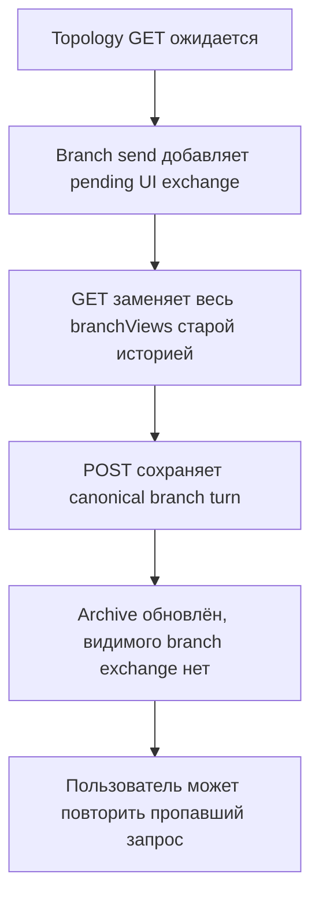
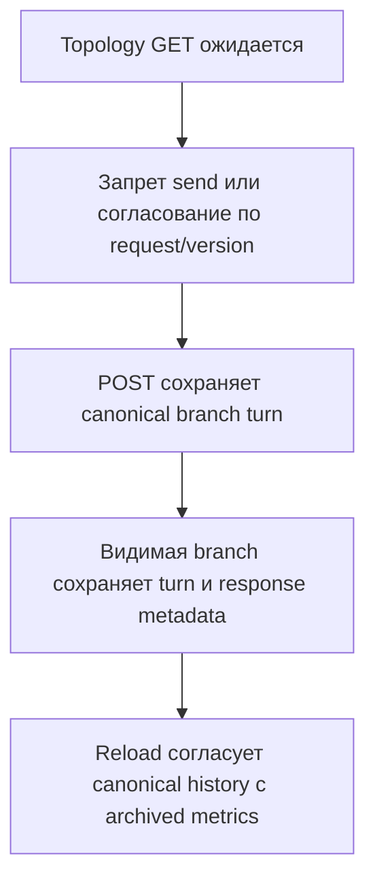

# AI Advent — точечная независимая проверка исправлений Week 2

Дата: 2026-09-12. Scope: только findings из `WEEK-2-FINAL-INDEPENDENT-REVIEW-2026-09-11.md` и регрессии, непосредственно вызванные `f2db863..b538516`. Это не повторный полный review архитектуры Week 2.

## FACTUAL STATE

- Фактическая ветка — `day_10`; HEAD — `b53851677238dc2136f090f5f6943d84db946504` (`fix: address week 2 review findings`). Его прямой parent — `f2db8634453182de927f21412fd069b8e33b8297` (`feat: add context management strategies`). Заданный диапазон соответствует Git.
- До создания этого отчёта и после точечных тестов единственными изменёнными tracked-файлами оставались известные несвязанные `README.md`, `docs/REFERENCES.md`, `docs/agent-runs/DAY-04.md`; staged diff пуст. Эти файлы не менялись и не очищались.
- `CURRENT-STATE.md` и документы Day 10 фиксируют исправления и их acceptance. Их выводы проверялись как утверждения, а не принимались как готовый verdict.

## REMEDIATION DIFF

`f2db863..b538516`: 21 файл, 1 111 добавлений, 122 удаления: 8 backend production, 5 backend tests, 3 frontend и 5 docs (в том числе исторический independent-review report). Изменения проверяют лимит для трёх фактических путей provider call, откладывают сохранение summary/facts до canonical commit, возвращают maintenance metrics в API errors, добавляют listing/валидацию topology, frontend-проекцию веток, выбор checkpoint и guards асинхронных topology-запросов.

## FINDING VERIFICATION

| Finding | Verdict | Evidence |
|---|---|---|
| HIGH-1 — сохранение Sticky Facts после commit | CLOSED | `EngineeringReviewAgent.java:122-131,160-171`: raw/runtime commit происходит до derived save; `IOException` derived-store логируется, а успешный ответ возвращается. `reconcile` на строках 145–157 восстанавливает stale/missing facts из canonical user messages. Межфайловая транзакция не вводилась. Тест `stickyFactsStorageFailureAfterCanonicalCommitReturnsTheCommittedTurn` прошёл. Ошибка derived save больше не провоцирует API-level retry уже сохранённого turn. |
| HIGH-2 — лимит maintenance и candidate state | CLOSED | `ConversationSummaryService.java:32-40`, `StickyFactsService.java:34-43`, `EngineeringReviewAgent.java:117-120`: каждый exact outbound проверяется до provider call. `EngineeringReviewAgent.java:92-100,122-129`: summary и facts остаются кандидатами до успеха main и canonical commit. Overflow/failure tests (`EngineeringReviewAgentTest.java:411-487`, `StickyFactsServiceTest.java:36-47`) прошли. Main `TokenMetrics` измеряет main outbound/response отдельно от maintenance. |
| HIGH-3 — branch-local frontend history | CLOSED | `app.ts:46-59,209-210,412-425,489-503,547-556` хранит branch ID и строит видимую проекцию только выбранной ветки; `app.html:21-25` рендерит её. После reload проекция восстанавливается из backend branch histories. Frontend-тест A/B и зафиксированная реальная A→B→A acceptance подтверждают отсутствие sibling continuation в выбранной ветке. Новый race проекции описан ниже отдельно: он скрывает свой turn, но не показывает sibling. |
| MEDIUM-1 — checkpoint selection/restart | PARTIAL | Все persisted checkpoints, включая orphan, доступны через `AgentBranchStore.java:62-64` и `AgentBranchController.java:42-45`. `app.ts:167-178,197,378` сохраняет и использует явный ID; fallback на «первую ветку» удалён. Но `app.ts:406` при каждом topology load переписывает сохранённый explicit checkpoint на checkpoint активной ветки. При активной A/C1 выбор orphan C2, reload и создание ветки приводят к POST на C1. Acceptance выбирала orphan *после* reload и этот сценарий не покрывает. |
| MEDIUM-2 — topology async races | CLOSED | `app.ts:153-181,390-410,531-545`: callbacks привязаны к dialog ID/generation, дубли topology-submit заблокированы, busy сбрасывается на актуальном success/error, ошибки видны. `activateDialog` инвалидирует старое поколение и сбрасывает busy. Тест stale-dialog/error прошёл. Этот verdict относится к topology operations; новый race topology-load против agent-send описан отдельно. |
| MEDIUM-3 — branch и ContextPolicy | CLOSED | Backend `AgentDialogService.java:48-52` оставляет branches только FULL. `app.html:275-286` скрывает выбор linear policy в branch mode; `app.ts:176-193,376-377,418-420` отправляет FULL с branch ID и восстанавливает `linearContextMode` при возврате. Frontend-тест прошёл. |
| MEDIUM-4 — maintenance metrics при поздней ошибке | PARTIAL | Backend `EngineeringReviewAgent.java:79-80,134-139,186-203` переносит completed maintenance metrics через ошибку; `AgentController.java:58-72` сохраняет статусы 413/502/500 и сериализует их без выдуманных main metrics и без persistent metrics system. Controller-тест прошёл. Но `app.ts:424` читает только текст ошибки, а `app.html:133-163` отображает maintenance metrics лишь при успешном `analysis`. Пользователь UI по-прежнему не видит оплаченные maintenance calls после main/overflow/storage failure. |
| LOW-1 — форма Sticky Facts на frontend | CLOSED | `app.ts:27-28` объявляет `{coveredUserMessageCount, facts}`, `app.spec.ts:198-199` использует вложенный fixture; backend `StickyFacts`/`ContextMetadata` совпадают. Frontend-тесты прошли. |
| LOW-2 — duplicate topology IDs | CLOSED | `AgentBranchStore.java:139-166` отвергает повтор checkpoint IDs, повтор branch IDs между checkpoint и несоответствие branch/checkpoint ownership при load. `AgentBranchStoreTest.java:43-63` покрывает persisted duplicates; точечные тесты прошли. |

### MEDIUM-1 — явный выбор checkpoint теряется после restart

- **SEVERITY:** MEDIUM
- **LOCATION:** `frontend/src/app/app.ts:197,378,406`.
- **EVIDENCE:** `selectCheckpoint(C2)` сохраняет C2; `activateDialog` восстанавливает C2; успешный `loadTopology` безусловно заменяет его на checkpoint активной branch C1 при ненулевом `branchId`. `createBranch` использует получившийся `checkpointId` на строках 167–172.
- **SCENARIO:** Активная ветка A принадлежит C1. Выбрать persisted orphan C2, перезагрузить диалог, затем создать ветку без повторного выбора. POST нацелится на C1.
- **IMPACT:** Explicit selection не является durable в обычном состоянии с активной веткой; новая ветка получает неверный base.
- **WHY REMEDIATION DID NOT CLOSE IT:** Listing и persisted UI field добавлены верно, но load-time синхронизация с branch перезаписывает независимый выбор пользователя. Имеющиеся тесты не проверяют сохранение C2 через reload при активной A.
- **FIX DIRECTION:** Сохранять валидный явно выбранный checkpoint при topology load; использовать checkpoint активной ветки лишь если выбора нет или он недействителен. Проверить URL создания новой ветки после такого reload.
- **CONFIDENCE:** HIGH: детерминированный путь присваивания; отдельный runtime-тест не выполнялся.

### MEDIUM-4 — frontend отбрасывает metrics из API error

- **SEVERITY:** MEDIUM
- **LOCATION:** `frontend/src/app/app.ts:424`; `frontend/src/app/app.html:133-163`.
- **EVIDENCE:** Новый backend `AgentError` содержит `summaryMetrics`/`factsMetrics`, но Angular error callback копирует лишь `errorMessage`; шаблон показывает эти metrics только в ветке успешного `analysis`.
- **SCENARIO:** Facts extraction завершился успешно, main call вернул 502. В HTTP body есть `factsMetrics`, но видимый exchange содержит только текст ошибки.
- **IMPACT:** UI-сравнение по-прежнему недосчитывает выполненную maintenance-работу на failure paths. API-consumer может её наблюдать, конечный пользователь UI — нет.
- **WHY REMEDIATION DID NOT CLOSE IT:** Изменён серверный error contract, но не его frontend consumer и error rendering.
- **FIX DIRECTION:** Читать structured maintenance metrics из agent error body и отображать рядом с ошибкой без fabricated main metric; добавить frontend fixture для 502/413.
- **CONFIDENCE:** HIGH: прямой trace consumer и template.

## NEW REGRESSIONS CAUSED BY REMEDIATION

### NEW-1 — topology reload стирает видимый in-flight или уже committed branch turn

- **SEVERITY:** HIGH
- **LOCATION:** `frontend/src/app/app.ts:209-210,259-263,390-407,412-425,475-503,547-556`; `frontend/src/app/app.html:21-25,302-308`.
- **EVIDENCE:** `loadTopology` на строке 401 заменяет всю карту `branchViews` GET-историями. Agent send добавляет pending exchange в эту же карту; `analyze()` и кнопка отправки проверяют `loading`, но не `topologyBusy`. Если GET с pre-turn snapshot завершается после append, pending exchange удаляется. `finishAgentResult` обновляет archive, затем отображает map по отсутствующему в branch view ID и не возвращает видимый результат. После reload raw turn text появляется из backend, но `exchangesFromHistory` конструирует только input/analysis и теряет сохранённые в UI archive response metrics, facts и summary metadata.
- **SCENARIO:** Перезагрузить диалог с выбранной branch A; пока GET branches/checkpoints выполняется, отправить сообщение. GET возвращает старую историю, затем POST успешно завершается. Backend сохраняет turn, UI archive его записывает, но видимая branch A не показывает ни pending, ни завершённый ответ. Пользователь может повторить «пропавший» turn. Даже без race обычный reload стирает metrics успешных branch calls из видимой проекции.
- **IMPACT:** Ложный видимый результат уже committed turn, риск ручного дублирующего retry, потеря Day 8/10 per-turn metrics и derived metadata в branch UI после restart. Canonical backend branch history остаётся целой.
- **HOW REMEDIATION INTRODUCED IT:** Новая `branchViews` и безусловная замена её при topology load отсутствовали в исходном commit; новая проекция не согласуется с archived/pending branch exchanges.
- **FIX DIRECTION:** Запретить send до окончания topology load либо согласовывать GET snapshot с более новыми/pending локальными exchanges; при reload сохранять response metadata из branch-owned UI archive, используя backend history как canonical membership. Добавить frontend-тест с задержанным topology GET против branch POST и тест сохранения metrics после restart.
- **CONFIDENCE:** HIGH: детерминированные frontend state transitions; 22 текущих теста такой порядок не моделируют, provider/browser call не выполнялся.

## ARCHITECTURAL INVARIANTS

- **PASS:** Linear raw history и branch topology остаются разными canonical stores. Summary и Sticky Facts — восстановимый derived state; отклонённый main turn не сохраняет свои candidates.
- **PASS:** Каждый main, summary и facts extraction/recovery outbound проходит limit check до provider call. Main и maintenance metrics разделены в успешном ответе и backend error payload.
- **PARTIAL:** Topology checkpoints перечисляются, но UI теряет explicit selection в branch-active restart.
- **FAIL:** Новый branch-view cache может разойтись с committed branch turn при пересечении topology-load/send и не сохраняет archived response metrics после reload.

Текущее состояние (**AS-IS**, до дальнейших product-правок):

Требуемое состояние (**TO-BE target, этим review не реализовано**):

## TESTS ACTUALLY RUN

- Backend, Java 21.0.6: `mvn -q '-Dtest=EngineeringReviewAgentTest,AgentControllerTest,AgentBranchStoreTest,AgentBranchControllerTest,StickyFactsServiceTest' test` — 34/34 PASS, 0 failures/errors/skipped. Первая sandbox-попытка не выполнила тесты из-за запрета сети при поиске parent POM; та же точечная команда завершилась успешно после разрешённой эскалации. Ожидаемые injected derived-store failures дали warning stack traces при успешных тестах.
- Frontend, Node 22.22.3: `npm test -- --watch=false --no-progress` — 22/22 PASS (один test file).
- Статическая проверка diff 21 файла, затронутых callers/templates/tests. Frontend production build, реальные provider calls, browser acceptance и полный Week 2 acceptance в этой проверке не запускались.

## ACCEPTANCE EVIDENCE CONSISTENCY

Исторические утверждения 96/96 backend, 22/22 frontend и frontend build PASS согласуются с точечными прогонами и текущим кодом, но независимо здесь повторены только 34 backend и 22 frontend tests. A–E targeted real acceptance подтверждает именно выполненные сценарии. Запрос длительностью 4.042 с при ожидании harness 3 с остаётся проблемой timing тестовой среды, не product defect. Он не проверял новый overlap topology GET/branch POST, сохранение explicit checkpoint *через* reload при другой активной ветке и UI-отображение error-side maintenance metrics. F/G имели только automated evidence: backend-тесты по этим путям прошли, но указанные frontend gaps остаются.

## REQUIRED BEFORE MERGE

1. Сохранить валидный explicit checkpoint selection через reload при другой активной ветке; проверить точный POST на выбранный checkpoint.
2. Отображать backend maintenance metrics в agent error без выдуманных main metrics.
3. Устранить race topology-load против branch-send и сохранить branch response metadata/metrics после reload; добавить точечные frontend regression tests.
4. После исправлений повторить затронутые frontend tests/build. Owner authorization на merge — отдельное решение.

## FINAL VERDICT

`READY_AFTER_FIXES`

## READY_FOR_OWNER_MERGE_DECISION

`NO`

## REPORT_FILE

`E:\sandbox\sandbox\ai-advent\docs\agent-runs\WEEK-2-POST-REVIEW-VERIFICATION-2026-09-12.md`

## REPORT_SAVED

`YES`

## REMEDIATION OUTCOME — 2026-09-12

Этот addendum сохраняет original verification findings выше verbatim. Исправлены именно
MEDIUM-1, MEDIUM-4 и NEW-1, без изменения backend. Selected checkpoint остаётся authoritative
base для new branch при topology reload; invalid selection детерминированно становится первым
available checkpoint или `null`. Structured error response теперь сохраняет summary/facts
maintenance metrics в UI result и шаблон отображает их вместе с error без main metrics.

Для NEW-1 выбран минимальный mutual exclusion: topology load не начинается, пока Agent request
in-flight, а Agent send заблокирован, пока topology current dialog загружается. Это исключает оба
порядка stale snapshot/send без reconciliation cache. Focused и полный frontend test run — 26/26
PASS; frontend build PASS с известными budget warnings.

Narrow browser acceptance 1440×1000 PASS: explicit C2 сохранился после real topology reload и
создал branch через C2 endpoint; при CDP-paused topology GET send был disabled, keyboard attempt
не создал agent POST, а после release UI снова разрешил send. CDP-fulfilled structured 502 без
provider call показал facts maintenance metrics и error, при этом main metrics не появились.
Raw evidence — ignored `docs/local/agent-sessions/day10-second-remediation-acceptance/`.
