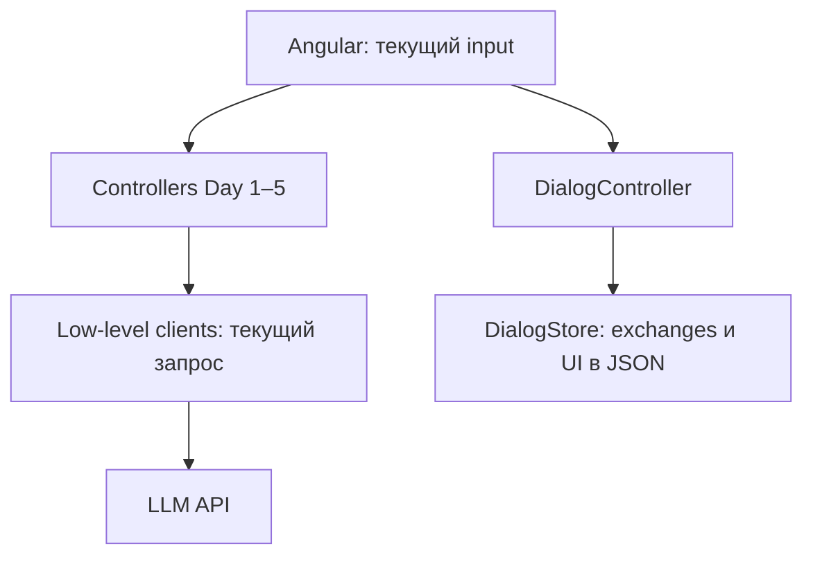
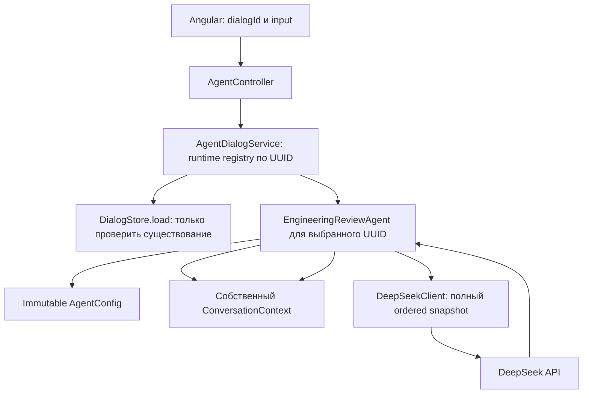

# Day 6 — агент с оперативной памятью диалога

Дата: 2026-09-10. Статус: **TECHNICALLY COMPLETE; deterministic tests/build PASS; real API PASS; UI 1440×1000 PASS; video PENDING**.
Baseline: `developer`, HEAD `06355effc56d60b4d43b58c7e274b0ec20622337`, Days 1–5 интегрированы.
Ветка реализации: `day_6`, создана от этого baseline; HEAD тот же, commit не создан.
План **OWNER APPROVED** явной командой «Implement the approved Day 6 plan»; реализация и
deterministic local verification разрешены. Последующая команда владельца разрешила real API/browser verification; commit/push не разрешены.
Разделы 1–11 сохраняют план с уточнением config; фактический результат — §12 и
[отчёт реализации](../agent-runs/DAY-06.md).
Предыдущий [анализ](../agent-runs/DAY-06-ANALYSIS.md) переиспользован; его раздел 11 фиксирует дельту.
Этот документ заменяет исторические предложения разделов 5–10 анализа.

## 1. Требование

Создать отдельную централизованную сущность агента: она принимает сообщение, владеет текущим
стеком беседы, вызывает существующую low-level LLM API integration и возвращает ответ в UI.
На каждом следующем turn агент сам отправляет всю накопленную беседу.
Доказательство результата: follow-up использует прошлый turn, два диалога изолированы,
разные экземпляры допускают разную конфигурацию, Day 1–5 сохраняют прежнее поведение.

## 2. Уточнения организатора

Источник — authoritative текст, предоставленный владельцем в текущей задаче; внешняя проверка
не требуется для переопределения этих условий.

- Агент — отдельная централизованная сущность, а не процедурный код вызова LLM.
- Агент сам владеет стеком сообщений и отправляет накопленный conversation на каждом turn.
- Управление контекстом намеренно простое: хранить всё и отправлять всё.
- Настройки представлены конфигурацией агента; возможны по-разному настроенные экземпляры.
- Один экземпляр приложения способен обслуживать много экземпляров агентов.
- Внутренняя архитектура на усмотрение команды; изменения должны быть минимальными.
- Продолжить существующую low-level API integration без agent framework.

## 3. Заданные границы Day 6 против Days 7–9

| День | Поведение | Граница расширения без ранней реализации |
|---|---|---|
| 6 | Runtime agents; полный ordered stack; один DeepSeek call на turn | Конкретный agent + config + context + registry |
| 7 | JSON или SQLite persistence и восстановление беседы после restart | Registry lifecycle и context data; storage interface сейчас не нужен |
| 8 | Измерение token/context usage и эксперименты с context limit | Low-level response parsing и подготовка ordered messages; метрики сейчас не добавлять |
| 9 | Отдельный summary + последние N raw messages | Подготовка контекста внутри агента; сейчас никакой summary policy |

В Day 6 не входят: запись/restore ConversationContext, JSON agentState/version/migration,
SQLite, tokenizer, новые usage/cost метрики, проверка конкретного context limit, truncation,
compression, summary, RAG, tools, autonomous loop, multi-provider routing, настройки агента в UI.
Существующие Day 5 usage/cost и существующий UI archive остаются без изменения поведения.

## 4. Архитектура и lifecycle

Текущее состояние, зафиксированное до реализации:



Целевое состояние **плана**, не evidence реализованного результата:



После будущей реализации актуализировать целевую диаграмму по факту.

- `EngineeringReviewAgent` — обычный stateful Java object, не singleton Spring bean.
  Получает config/client при создании, сам создаёт и владеет своим context; `reply(input)`
  централизует один turn от подготовки сообщений до фиксации ответа.
- `ConversationContext` — небольшой конкретный класс с ordered list и вложенным immutable
  `Message(role, content)`. System появляется один раз при создании; наружу доступны snapshots,
  а не изменяемый список. Нет интерфейса ContextStrategy или методов save/restore заранее.
- `AgentDialogService` — singleton Spring service с `ConcurrentHashMap<UUID, EngineeringReviewAgent>`.
  На первом обращении проверить `DialogStore.load(id)`, затем атомарно создать агент через
  `computeIfAbsent`. Нормализовать UUID для ключа и lookup; разные строковые формы одного UUID
  не должны создавать разные экземпляры. Повторный turn использует тот же объект.
- `DialogStore` участвует только как существующий каталог идентичностей. Не переносить в агент
  exchanges, comparison cards, generated prompts, UI settings или старые ответы. На повторном
  runtime lookup не нужна загрузка истории. Store и DialogController не изменяются.
- Registry живёт до остановки backend. Все агенты и context исчезают при restart. Новый UUID
  всегда начинает новую беседу; старый UUID после restart тоже начинает новую беседу.
  Browser refresh и переключение sidebar при живом backend не сбрасывают agent context.
- Один process может держать много агентов. Разные immutable AgentConfig можно передать
  конструкторам одновременно; UI/registry Day 6 создаёт экземпляры с одним default preset.
  Для доказательства разных конфигураций достаточно deterministic test, без нового config API.
- Агент защищает полный turn своим `tryLock`; конкурирующий запрос тому же агенту получает 409
  без второго provider call. Lock освобождается в finally. Другой агент может отвечать независимо.
  Не держать глобальный registry/store lock во время LLM call. Distributed state и eviction вне scope.

## 5. AgentConfig и low-level transport

Immutable record: `AgentConfig(String model, String systemPrompt, Double temperature, Integer maxTokens)`.
Config фиксируется на lifetime агента; не меняется от переключения экспериментов/селекторов UI.
Уточнение при реализации по новой инструкции владельца: `max_tokens` уже существует в
DeepSeekClient для Day 2, поэтому output limit представлен nullable maxTokens и для агента.
Default null сохраняет прежнее FREE-поведение; это не новый token/context metric Day 8.

| Поле или существующая настройка | Решение и причина |
|---|---|
| model | В config; default `deepseek-v4-flash`, уже используется DeepSeekClient |
| systemPrompt | В config; default — точный Day 1 mentor prompt: инженерный анализ, русский, Markdown |
| temperature | Nullable в config; уже поддерживается existing Day 4 integration. Default null означает отсутствие поля в JSON, как Day 1; explicit значение сериализуется без подмены |
| stream=false | Остаётся wire-инвариантом синхронного клиента; streaming UI не добавляется |
| thinking.type=disabled | Сохраняется existing wire preset; новый thinking mode не вводится |
| maxTokens | В config, nullable; existing max_tokens mapping и bounds 100…2000 из Day 2. Default null — поле отсутствует, явный лимит действует только на данный agent instance |
| Day 2 ReviewControls, response_format | Не переносить: JSON shape, word limits и termination instruction остаются в controlled experiment |
| Day 3 strategy/generated prompt | Не переносить: orchestration независимого эксперимента, не конфигурация Day 6 беседы |
| Day 5 ModelProfile, effort, ceiling, tier, store, цены | Не переносить: direct OpenAI experiment остаётся самостоятельным |
| URL, HttpClient, API key/headers | Только transport/DI; не config/state агента |
| dialogId, loading, evaluations, selectors | Identity/UI, не AgentConfig |

Для config: model/systemPrompt непустые; explicit temperature — одно из существующих значений
Day 4: 0, 0.7, 1.2. Это локальная граница Day 6, не утверждение о полном диапазоне API.
Explicit maxTokens — 100…2000. `top_p/top_k` не используются текущим кодом и не добавлены.
Не создавать model catalog и не обещать доступность произвольного model ID: default уже в baseline.

`DeepSeekClient` получает additive completion method с явными ordered typed messages и
model/temperature/maxTokens. System уже в списке от агента: клиент не добавляет второй system и не выбирает
историю. JSON mapping/HTTP/parsing/errors остаются в клиенте. Переиспользовать существующий send,
отделив его от проверки одиночного input; все legacy entrypoints сохраняют прежнюю validation.
Не передавать фиктивный input ради прежней private send-сигнатуры.
Legacy analyze/analyzeControlled/analyzeWithSystem/analyzeAtTemperature и их payload не менять.
Не выносить все старые prompts/services в новую framework ради «централизации».

## 6. История, API и минимальный UI

Успешные вызовы:

```text
turn 1 request: [system, user1]
turn 1 committed: [system, user1, assistant1]
turn 2 request: [system, user1, assistant1, user2]
turn 2 committed: [system, user1, assistant1, user2, assistant2]
```

Агент строит candidate snapshot и вызывает client ровно один раз. Только после успешного
непустого ответа фиксирует пару user/assistant. Failure оставляет committed stack неизменным;
повторное ручное сообщение не включает предыдущую неуспешную попытку. Нет automatic retry,
пустых assistant сообщений или включения UI errors/loading. Отправляется весь stack без
ограничения N и скрытой обработки. Provider error, в том числе превышение контекста, остаётся
видимой ошибкой; пользователь может открыть новый диалог. Exactly-once при потере HTTP response
не обещается; deduplication/turnId сейчас не нужны.

API: `POST /api/dialogs/{id}/agent/messages`, request `{ "input": "…" }`, response
`{ "analysis": "…" }`. Browser не отправляет history, model или system overrides.
Controller валидирует input/id и делегирует service; он не собирает сообщения и не вызывает client.
Malformed UUID, null/blank input → 400; неизвестный UUID → 404; busy → 409; provider failure → 502;
ошибка существующего store lookup → 500, до LLM call. Body ошибок `{error, rawResponse: null}`.
404/busy handlers локальны AgentController: existing global advice в ReviewController сейчас
преобразует DialogNotFoundException как IllegalArgumentException в 400; старый контракт не менять.

UI: добавить experiment и exchange mode `AGENT`; сохранить `free: ResultState` для Markdown,
loading/errors через существующий result template. Новый route в analyze, отдельная метка ответа
«Агент». В app.html явно отделить AGENT от controlled fallback и temperature-only controls/actions.
Вкладка не предлагает comparison и не использует старые mode/strategy/temperature/model selectors.
Sidebar и «Новый диалог» уже достаточны для A → B → A; отдельная session model не нужна.

Существующий `persistDialog` продолжает сохранять **видимый UI archive** (включая AGENT exchanges)
и выбранную вкладку. Это намеренное переиспользование Day 1–5, не сохранение backend context:
ни config, ни canonical message list туда не добавлять и обратно в агента не импортировать.
Постоянное пояснение вкладки: «Агент помнит свою переписку до перезапуска сервера.
Сохранённые сообщения после перезапуска остаются видимыми, но агент их не помнит».
После refresh UI загружает архив; при живом backend агент продолжает свой runtime stack.
После restart архив тоже виден, но первый новый вызов отправляет только system + новый input.
Не вводить GET agent history, reconciliation или определение server epoch ради Day 6.

## 7. Точные файлы будущей реализации

Все пути относительно корня ai-advent. Новые классы остаются в существующем package.

| Production-файл | Изменение |
|---|---|
| `app/src/main/java/dev/aiadvent/mentor/AgentConfig.java` — новый | Immutable config/default preset |
| `app/src/main/java/dev/aiadvent/mentor/ConversationContext.java` — новый | Ordered runtime messages; вложенный Message record |
| `app/src/main/java/dev/aiadvent/mentor/EngineeringReviewAgent.java` — новый | reply, context ownership, per-agent guard |
| `app/src/main/java/dev/aiadvent/mentor/AgentDialogService.java` — новый | UUID registry, existing dialog lookup, создание агентов |
| `app/src/main/java/dev/aiadvent/mentor/AgentController.java` — новый | Endpoint, вложенные DTO/local error handlers |
| `app/src/main/java/dev/aiadvent/mentor/DeepSeekClient.java` | Ordered-message completion/JSON mapping, reuse HTTP send |
| `frontend/src/app/app.ts` | AGENT types/routing/exchange; existing persistence и result reuse |
| `frontend/src/app/app.html` | Вкладка/пояснение/rendering; явные temperature-only branches; Day 6 badge |

| Test-файл | Проверяемое поведение |
|---|---|
| `app/src/test/java/dev/aiadvent/mentor/EngineeringReviewAgentTest.java` — новый | Ordered turns, config propagation/isolation, failure rollback, same-agent concurrency |
| `app/src/test/java/dev/aiadvent/mentor/AgentDialogServiceTest.java` — новый | UUID mapping, atomic creation, разные агенты, отсутствие restore/write |
| `app/src/test/java/dev/aiadvent/mentor/AgentControllerTest.java` — новый | MVC request/response, 400/404/409/502/500; без provider call на invalid/missing |
| `app/src/test/java/dev/aiadvent/mentor/MainTest.java` | Exact ordered wire JSON/settings плюс прежний Day 1–4 contract |
| `frontend/src/app/app.spec.ts` | AGENT requests/controls/rendering, A/B/A, UI archive и отсутствие history в body |

Не нужны изменения DialogStore.java/DialogStoreTest.java/DialogController.java,
EngineeringReviewMentorApplication.java, старых controllers/services, OpenAiResponsesClient,
ModelProfile/model-result.ts, app.scss, dependencies, properties, scripts или JSON schema.
Context/config проверять через поведение агента, без отдельных механических test-файлов.

Документация этой planning-сессии: только `docs/agent-runs/DAY-06-ANALYSIS.md` и этот файл.
В будущей implementation-сессии: актуализировать этот task; `docs/CURRENT-STATE.md`,
`docs/SESSION_START.md`, `README.md` для нового runtime поведения; concise evidence в
`docs/agent-runs/DAY-06.md`. Исторические task docs Days 1–5 не переписывать.

## 8. Deterministic acceptance — без внешнего API

1. Mock client/captured snapshots: точное содержимое и роли turn 1/2/3, system ровно один,
   ранние сообщения остаются полностью; ранее переданный snapshot не мутирует после ответа.
2. A1 → B1 → A2: второй запрос A содержит только A1/ответ A1/A2; первый B только system/B1.
   Повторный UUID даёт тот же агент; разные UUID — разные агенты. Race первого создания не
   создаёт два используемых context. Проверки concurrency через latches/barriers, без sleeps.
3. Два агента с разными config передают свои model/systemPrompt/temperature; изменение истории
   одного не меняет другой. Default не сериализует temperature; explicit temperature сериализуется.
4. Exception/пустой provider result не фиксирует пару. Следующий turn исключает failed input;
   lock освобождён, retries нет. Конкурентный turn A → 409/один вызов; B может завершиться,
   пока первый A удерживается mock-клиентом.
5. Новый registry над тем же fake/store lookup со старыми UI exchanges начинает с system/user;
   ни create/update/write, ни импорт state не вызываются. Существующий архив не удаляется.
6. MVC: successful analysis и точные статусы §6; null/blank input, malformed/missing UUID
   не создают provider call. Ошибки не раскрывают headers/credentials/raw provider dumps.
7. MainTest: полный ordered JSON, model, stream=false, thinking.disabled, optional temperature.
   Existing Day 1–4 bodies/validation и весь Day 5 regression без изменения ожиданий.
8. Angular HttpTestingController: два sends передают только input на UUID endpoint; A/B/A
   показывает свои bubbles; loading/error/safe Markdown работают. AGENT не показывает controlled
   metadata/temperature/comparison UI. PUT сохраняет UI archive; reload не посылает его модели.
9. Existing backend/frontend suite и production builds проходят. PASS фиксировать только после
   исполнения; текущий план не переносит старые числа тестов как evidence Day 6.

## 9. Real-API и video acceptance — будущая отдельная проверка

После разрешения владельца на запуск/real API, desktop 1440×1000:

1. В новом A выбрать «Агент»: «Для учебного проекта имя очереди — cedar-queue-47.
   Запомни его в рамках нашей беседы». Дождаться реального ответа.
2. В новом B спросить: «Какое имя очереди я сообщил в этом диалоге?» Ответ не должен знать
   маркер A; ожидается отсутствие данных или уточнение, а не выдуманное воспоминание.
3. Вернуться в A: «Повтори только имя очереди, которое я сообщил ранее». Ожидается
   cedar-queue-47; второй prompt не содержит само имя. Показать A → B → A и ответы на видео.
4. Зафиксировать на backend перед HTTP send безопасное evidence ordered messages для A2/B1
   (debugger или локальный test capture, без Authorization). Browser network показывает только
   input и сам по себе не доказывает outbound LLM history. Хороший ответ модели также не заменяет
   deterministic доказательство состава сообщений. Не добавлять диагностический product endpoint.
5. Показать пояснение runtime-only памяти. Restart не является положительной демонстрацией
   восстановления Day 6; отсутствие restore доказано deterministic критерием 5.
6. Видео показывает вкладку, два диалога и follow-up; факт сохранения/загрузки записи подтверждает
   владелец отдельно. Не считать browser replay доказательством наличия видеофайла.

Real API недетерминирован: при неожиданном ответе отдельно оценить правильность wire history;
не повторять автоматически ради удачного видео. Использовать только синтетические данные.

## 10. Команды владельцу после реализации

В этом planning-проходе команды не исполнялись. Для локальных build/tests (без LLM calls):

```powershell
Set-Location E:\sandbox\sandbox\ai-advent
$env:JAVA_HOME = 'C:\Program Files\Java\jdk-21'
$env:Path = "$env:JAVA_HOME\bin;$env:Path"
mvn '-Dtest=EngineeringReviewAgentTest,AgentDialogServiceTest,AgentControllerTest,MainTest' test
mvn clean package
Set-Location E:\sandbox\sandbox\ai-advent\frontend
nvm use 22.22.3
npm test -- --watch=false
npm run build
```

Для будущего разрешённого ручного demo, отдельные PowerShell-окна:

```powershell
Set-Location E:\sandbox\sandbox\ai-advent
$env:JAVA_HOME = 'C:\Program Files\Java\jdk-21'
$env:Path = "$env:JAVA_HOME\bin;$env:Path"
.\scripts\run-backend.ps1
```

```powershell
Set-Location E:\sandbox\sandbox\ai-advent\frontend
nvm use 22.22.3
npm start -- --port 4201
```

Открыть `http://localhost:4201`; каждый send во вкладке агента вызывает реальный DeepSeek API.
DB-команды и migrations не нужны. API key остаётся в уже существующем локальном environment setup.

## 11. Риски, rollback и открытые вопросы плана

Полная история и registry растут до restart: это сознательный Day 6 tradeoff, без TTL/лимитов.
UI archive после restart видим, но не является памятью модели — это явно объясняет вкладка.
При потере ответа клиенту turn уже может быть committed: automatic retry/dedup не обещаются.
Сохранение UI и runtime turn не атомарны; storage reconciliation не добавляется.

Rollback будущей реализации: отменить только перечисленные Day 6 additions/edits, сохранив
пользовательские изменения и JSON-архив; миграции/очистка данных не требуются. Сохранённые AGENT
карточки не обещают совместимость со старым frontend; для old-code demo использовать новый
диалог, не удаляя архив. Этот planning-проход не меняет runtime и не требует runtime rollback.

Открытые вопросы, способные изменить реализацию: **NONE**.
На этапе planning реализация, ветка и проверки не выполнялись. Следующая разрешённая
implementation-сессия завершена ниже; этот исторический planning checkpoint не является текущим статусом.

## 12. Фактическая реализация и verification — 2026-09-10

Реализованы все production/test файлы §7. `AgentConfig` содержит четыре поля с уточнением §5.
`ConversationContext.Message` — immutable record; snapshot списка неизменяемый. Агент держит
private context и per-instance ReentrantLock. `AgentDialogService` хранит ConcurrentHashMap
по UUID, создаёт через computeIfAbsent; DialogStore используется только для load существующего id.
`AgentController` использует UUID path binding и local handlers 404/409, остальные ошибки
обслуживает существующий advice. Продуктовый DialogStore/JSON schema/DI/Days 1–5 не изменялись.

TO-BE — фактически реализовано:

```mermaid
sequenceDiagram
    participant UI as Angular Агент
    participant C as AgentController
    participant R as AgentDialogService
    participant A as EngineeringReviewAgent
    participant L as DeepSeekClient
    UI->>C: POST UUID + input
    C->>R: reply(UUID, input)
    Note over R: Первый lookup: DialogStore.load, затем computeIfAbsent
    R->>A: reply(input)
    Note over A: tryLock на весь turn, busy = 409
    A->>L: complete(весь snapshot, model, temperature, maxTokens)
    Note over L: JSON/HTTP + validation ответа; без реального вызова в этом прогоне
    L-->>A: analysis либо exception
    Note over A: Только успешный ответ фиксирует user + assistant; finally unlock
    A-->>UI: analysis через service/controller
```

| Проверка | Evidence |
|---|---|
| Backend regression + package | `mvn package`: 58 tests, 0 failures/errors/skipped; BUILD SUCCESS; 14.142 s |
| Day 6 agent behavior | EngineeringReviewAgentTest: 5; ordered 3 turns, failure rollback, разные config, lock/isolation, invalid inputs/config |
| Registry/restart | AgentDialogServiceTest: 2; A/B/A, fresh service, неизменность UI JSON, concurrent initial requests |
| API | AgentControllerTest: 3; success и 400/404/409/502/500 через MockMvc, real service и mocked I/O |
| Transport | MainTest: 19 total, включая 2 новых: ordered JSON/options и пустой HTTP ответ не попадает в context |
| Frontend | `npm test -- --watch=false`: 17/17 PASS; 2 новых AGENT tests, прежние 15 без изменения ожиданий |
| Frontend production | `npm run build`: PASS, 7.519 s; 492.23 kB initial; existing app.scss warning 9.00 kB против 4 kB warning budget |
| Real API / browser / video | NOT RUN / PENDING |

Первый `mvn clean package` выявил ошибку синхронизации в новом тесте (barrier внутри synchronized
mock DialogStore.load). Barrier перенесён на старт запросов; последующий полный `mvn package`
прошёл. Production fix для этого не требовался. Frontend выполнялся на Node 22.22.3/npm 10.9.8
через process-local PATH, глобальный nvm не переключался. Backend — Java 21/Maven 3.9.9.

Отклонение от изначального плана: nullable maxTokens добавлен согласно прямому уточнению
владельца; defaults/Days 1–5 не изменены. Будущие Days 7–9 не реализованы.
Точные команды и доказательства — [DAY-06 run](../agent-runs/DAY-06.md).
Следующий шаг: desktop UI verification 1440×1000 после устранения блокировки окружения; API результат — §13.

## 13. Реальная API-проверка — 2026-09-10

Сценарий выполнен напрямую через `POST /api/dialogs/{id}/agent/messages` на backend :18080.
Ровно **4 provider calls**, без retries, 23:52:14–23:52:46 +03:00. Все ответы HTTP 200.

| Turn | Точный input | Результат |
|---|---|---|
| A1 | Для этого диалога запомни правило ревью: главный приоритет — идемпотентность. Ответь кратко, что правило принято. | PASS — правило принято |
| A2 | Какой главный приоритет ревью я задал? | PASS — идемпотентность |
| B1 | Какой главный приоритет ревью я задал ранее? | PASS — предыдущий приоритет неизвестен, контекст A не раскрыт |
| A3 | Используй заданный приоритет и назови один риск повторной обработки PaymentReceived. | PASS — идемпотентность, риск двойного зачисления средств |

Временные non-suspending debugger logpoints в DeepSeekClient зафиксировали фактический
requestBody перед HTTP send и endpoint/status после него. Во всех четырёх запросах реальный
`https://api.deepseek.com/chat/completions`, model `deepseek-v4-flash`, HTTP 200.
Порядок сообщений: A1 S/U; A2 S/U1/A1/U2; B1 S/U; A3 S/U1/A1/U2/A2/U3.
Содержимое предыдущих user/assistant сообщений точно сверено с сохранёнными входами/ответами.
B1 содержит только system и собственный input. Это проверка исходящих запросов, а не только
вывод по тексту ответа модели. Credentials/Authorization не захватывались.

Санитизированные evidence: ignored `docs/local/agent-sessions/day6-api-verification/`:
`A1.json`, `A2.json`, `B1.json`, `A3.json`, `provider-trace.json`, `verification-result.json`.
Raw payloads не добавляются в Git. Временные logpoints, attach session и run configuration удалены;
product code не менялся, PRE_EXISTING изменения сохранены.

UI **BLOCKED_BY_BROWSER_ENVIRONMENT**: Chrome 1440×1000 показывает ERR_CONNECTION_REFUSED
для localhost:4201; shell frontend HTTP также недоступен (IPv6 — socket access denied).
Backend HTTP доступен. Это не установленный UI defect. Desktop rendering/loading/console и
переключение диалогов через Angular ещё не проверены. Прямые API turns не сохраняют Angular
UI archive; эти ответы нельзя считать доказательством отображения карточек в UI.
Day 6 в целом и video остаются незавершёнными; Days 7–9 не выполнялись.

## Desktop UI verification — 2026-09-11, 00:15 +03:00

**PASS; Day 6 TECHNICALLY COMPLETE.** Video PENDING; commit/push/merge не выполнялись.
Подтверждено: PID 28532 — Angular этого repo, listener только ::1:4201. Остановлен только
этот процесс; штатный запуск из frontend: npm start -- --port 4201 --host 127.0.0.1.
Новый PID 27672 слушает 127.0.0.1:4201; shell HTTP 200. Product code/config не менялись.

Chrome открыл http://127.0.0.1:4201/, фактический viewport 1440×1000.
Создан свежий диалог A, выбрана вкладка «Агент», отправлено:
«UI Day 6: кратко назови один риск повторной обработки PaymentReceived. Ответь Markdown:
жирный заголовок, один пункт списка и имя события в inline code.»
Ровно **1 дополнительный реальный LLM call**, без retries; суммарно Day 6 — 5 (4 API + 1 UI).
Loading: видны «Ментор анализирует...» и progressbar, submit отключён.
Успешный ответ о двойном зачислении отображён; DOM содержит strong, li и code,
визуальный screenshot просмотрен — layout и Markdown корректны.
Создан диалог B: пустой экран ввода. Возврат в A восстановил видимую пару user/assistant
и выбранную вкладку «Агент». Дополнительных сообщений в B/A не отправляли.
Chrome console error/warn/issue: NONE. Backend context/isolation повторно не проверялись.

Локальный evidence: ignored docs/local/agent-sessions/day6-verification/frontend-ipv4.log
и ui-result.json. Screenshot просмотрен в tool response; сохранение через Chrome MCP в repo
отклонено workspace policy инструмента, поэтому screenshot-файл не заявляется.
Предыдущая блокировка окружения снята IPv4 binding. Days 7–9 не выполнялись.